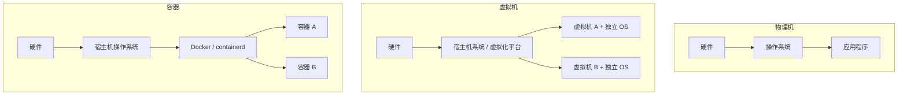
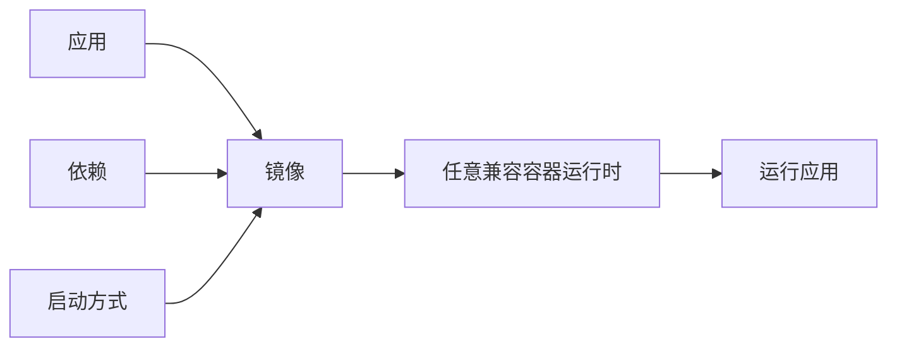
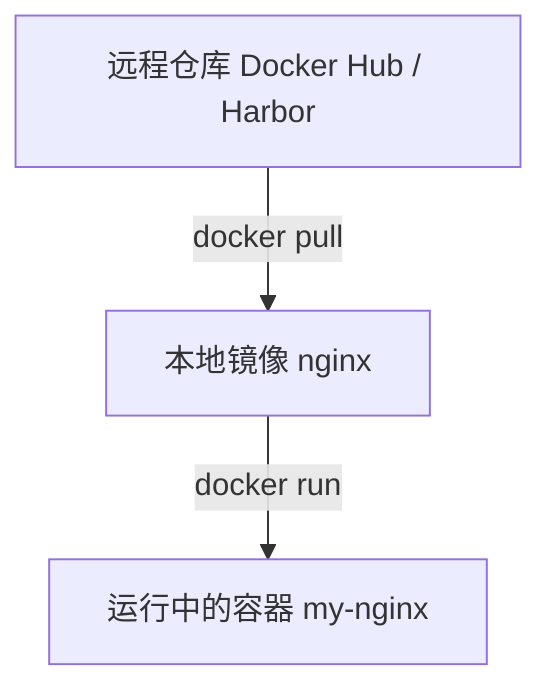

# 容器核心概念

容器是云原生学习的基础。理解容器之前，先把物理机、虚拟机、容器、镜像、仓库和 tag 这些概念放到同一张图里看清楚。

## 物理机、虚拟机与容器

物理机、虚拟机、容器都是运行程序的环境，但它们所在层级不同。

> 物理机是真实硬件；虚拟机是在物理机上模拟出来的一整台电脑；容器是在操作系统里隔离出来的一组进程。



| 对比项 | 物理机 | 虚拟机 | 容器 |
| --- | --- | --- | --- |
| 本质 | 真实硬件 | 虚拟出来的一台电脑 | 隔离出来的一组进程 |
| 完整操作系统 | 有 | 有 | 通常没有 |
| 独立内核 | 有 | 有 | 一般共享宿主机内核 |
| 启动速度 | 慢 | 较慢 | 很快 |
| 资源占用 | 高 | 中等偏高 | 低 |
| 隔离性 | 最强 | 很强 | 较强 |
| 常见用途 | 高性能服务、数据库 | 云服务器、测试环境 | 应用部署、微服务、CI/CD |

容器不是一台完整电脑，而是操作系统中隔离出来的一组进程。容器通常共享宿主机内核，但拥有相对独立的文件系统、进程空间、网络配置、环境变量和依赖库。

## 为什么要使用容器

容器的核心价值是把应用和运行环境打包到一起，让交付、部署和运行更加一致。



容器带来的直接收益：

- 一次构建，到处运行，减少“开发能跑、生产报错”的环境差异。
- 镜像是不可变交付物，部署结果更容易复现。
- 同一个镜像可以运行在本地 Docker、测试环境、生产服务器、Kubernetes 集群和 CI/CD 流水线。
- 容器共享宿主机内核，不需要像虚拟机一样为每个应用启动完整操作系统，启动更快、资源占用更少。
- 通常一个容器只运行一个主要进程，便于资源限制、日志收集、健康检查和生命周期管理。

容器尤其适合 Web 服务、微服务、API 服务、批处理任务、CI/CD 构建任务，以及可水平扩展的无状态应用。

## 镜像、容器与仓库

Docker 世界里有三个核心概念：镜像是模板，容器是运行起来的实例，仓库是存放镜像的地方。



| 概念 | 说明 | 类比 |
| --- | --- | --- |
| 镜像 Image | 只读模板，包含应用、依赖、运行时、配置和启动命令 | 安装包 / 模板 |
| 容器 Container | 由镜像创建并运行起来的实例 | 正在运行的应用环境 |
| 仓库 Registry | 存放和分发镜像的服务 | 软件仓库 |

示例：

```bash
docker run -d --name my-nginx nginx
```

这条命令表示：使用 `nginx` 镜像创建并启动一个叫 `my-nginx` 的容器。一个镜像可以创建多个容器，每个容器都有自己的运行状态和可写层。

常见镜像仓库：

- Docker Hub
- Harbor
- GitHub Container Registry
- 阿里云容器镜像服务
- 腾讯云 TCR
- AWS ECR

## 镜像地址与版本标签

镜像地址用于告诉 Docker 或 containerd 去哪里拉取镜像、拉取哪个仓库下的哪个镜像，以及使用哪个版本。

以这个镜像为例：

```text
gcr.k8s.io/coreos/prometheus-adapter:0.8
```

| 片段 | 含义 |
| --- | --- |
| `gcr.k8s.io` | Registry 地址，也就是镜像仓库服务地址 |
| `coreos` | Repository 命名空间或目录 |
| `prometheus-adapter` | 镜像名称 |
| `0.8` | Tag，表示版本号 |

如果不写 registry，Docker 默认从 Docker Hub 拉取：

```bash
docker pull redis
```

等价于：

```text
docker.io/library/redis:latest
```

如果不写 tag，默认使用 `latest`。

## 不建议依赖 latest

`latest` 只是一个普通标签，不一定代表真正最新，也不代表稳定。生产环境建议使用明确版本：

```bash
docker pull redis:8-alpine
docker pull nginx:1.27-alpine
```

明确版本的好处：

- 部署结果可重复。
- 回滚更清晰。
- 排查问题时能定位版本差异。
- 避免上游镜像更新导致行为变化。

## 本节回顾

- 容器是隔离进程，不是完整虚拟机。
- 容器的价值在于交付一致、启动快、资源占用低、适合自动化部署。
- 仓库存镜像，镜像起容器，容器跑应用。
- 生产环境应使用明确镜像 tag，不依赖 `latest`。

