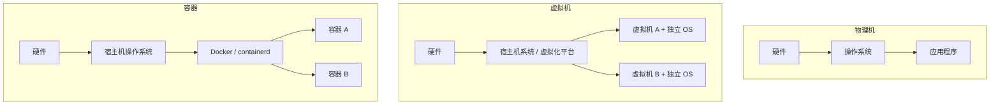
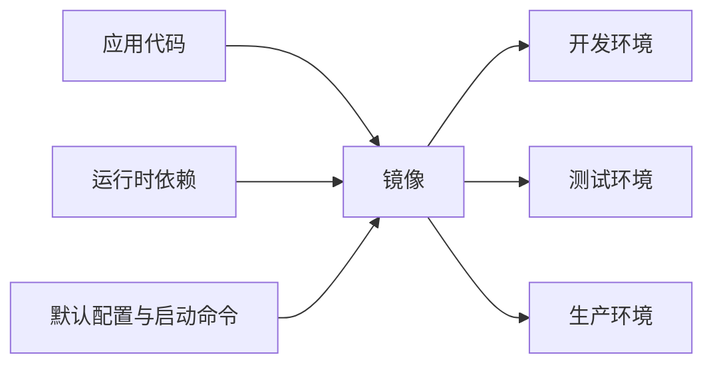
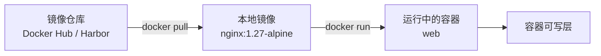

# 容器核心概念

容器是云原生技术体系的基础。进入容器操作记录之前，先将物理机、虚拟机、容器、镜像、仓库和 tag 等核心概念梳理清楚，建立统一的认知框架。

## 物理机、虚拟机与容器

物理机、虚拟机和容器都可以运行应用程序，但抽象层级和隔离方式不同。

> 物理机直接运行在真实硬件上；虚拟机是在虚拟化平台上运行的完整操作系统；容器是在宿主机操作系统内被隔离出来的一组进程。



| 对比项  | 物理机         | 虚拟机           | 容器             |
|------|-------------|---------------|----------------|
| 本质   | 真实硬件        | 虚拟出的完整计算机     | 被隔离的一组进程       |
| 操作系统 | 直接安装完整操作系统  | 每台虚拟机都有独立操作系统 | 共享宿主机内核        |
| 启动速度 | 慢           | 较慢            | 快              |
| 资源占用 | 高           | 中等偏高          | 低              |
| 隔离强度 | 最强          | 很强            | 较强             |
| 典型场景 | 高性能数据库、专用设备 | 云服务器、测试环境     | 微服务、CI/CD、弹性部署 |

容器并不包含独立内核，也不是一台完整的计算机。容器内看到的进程、网络、文件系统和主机名等内容，是 Linux 内核通过 namespaces 隔离后的结果；容器能够使用的 CPU、内存和 I/O 资源，则通常由 cgroups（常见为 cgroups v2）进行限制。

## 容器解决的问题

传统部署方式中，应用运行依赖操作系统版本、动态库、语言运行时、配置文件和启动脚本。开发环境可以正常运行的程序，在测试环境或生产环境中失败，往往是因为这些依赖并不一致。

容器的核心价值是将应用及其运行环境打包为镜像，再通过统一的运行时启动。这样，交付物不再只是一段代码，而是包含依赖、目录结构、默认命令和元数据的标准化镜像。



容器带来的主要收益包括：

- 镜像作为不可变交付物，部署结果更容易复现。
- 同一镜像可以在本地 Docker、CI/CD 流水线、测试服务器和 Kubernetes 集群中运行。
- 容器启动不需要加载完整操作系统，启动速度快，资源开销低。
- 应用进程、文件系统、网络和环境变量相互隔离，便于统一运维。
- 日志、健康检查、资源限制和生命周期管理具备标准化入口。

容器特别适合 Web 服务、API 服务、微服务、批处理任务、CI/CD 构建任务，以及能够水平扩展的无状态应用。对于强依赖本地硬件、内核模块、图形桌面或复杂状态管理的系统，则需要结合具体场景评估。

## 镜像、容器与仓库

Docker 体系中有三个核心对象：镜像是只读模板，容器是由镜像创建并运行的实例，仓库是存放和分发镜像的服务。



| 概念           | 说明                          | 类比      |
|--------------|-----------------------------|---------|
| 镜像 Image     | 只读模板，包含应用、依赖、文件系统层、默认命令和元数据 | 安装包     |
| 容器 Container | 由镜像创建的运行实例，拥有独立运行状态和可写层     | 正在运行的应用 |
| 仓库 Registry  | 存储和分发镜像的服务                  | 软件包仓库   |

以下命令会使用 `nginx` 镜像创建并启动一个名为 `my-nginx` 的容器：

```bash
docker run -d --name my-nginx nginx:1.27-alpine
```

同一个镜像可以启动多个容器。每个容器共享镜像的只读层，但拥有各自独立的可写层，因此容器内临时写入的数据不会自动回写到镜像，也不会影响由同一镜像启动的其他容器。

常见镜像仓库包括 Docker Hub、Harbor、GitHub Container Registry、阿里云容器镜像服务、腾讯云 TCR 和 AWS ECR。企业生产环境通常会使用私有仓库统一管理基础镜像、业务镜像、漏洞扫描和访问权限。

## 镜像地址、标签与 digest

镜像地址用于描述镜像所在仓库、命名空间、镜像名称和版本标签。

以下镜像地址为例：

```text
gcr.io/example/prometheus-adapter:0.8
```

| 片段                   | 含义                  |
|----------------------|---------------------|
| `gcr.io`             | Registry 地址，即镜像仓库域名 |
| `example`            | 命名空间，通常对应组织、项目或团队   |
| `prometheus-adapter` | 镜像名称                |
| `0.8`                | Tag，表示镜像标签          |

若省略 Registry，Docker 默认从 Docker Hub 拉取镜像：

```bash
docker pull redis
```

该命令通常等价于：

```text
docker.io/library/redis:latest
```

Tag 是镜像的可读版本标识，便于人类理解和发布管理；digest 是镜像内容的哈希标识，指向更精确的镜像内容。生产环境中，如果对可复现性和供应链安全要求较高，可以在发布系统中记录镜像 digest。

查看镜像 digest：

```bash
docker image inspect nginx:1.27-alpine --format '{{index .RepoDigests 0}}'
```

::: details 输出类似如下

```text
nginx@sha256:65645c7bb6a0661892a8b03b89d0743208a18dd2f3f17a54ef4b76fb8e2f2a10
```

:::

## 不建议依赖 latest

`latest` 只是一个普通标签，不保证代表最新版本，也不保证稳定。镜像维护者可以将 `latest` 指向新的镜像内容，导致同一条部署命令在不同时间拉取到不同结果。

生产环境应使用明确版本标签，例如：

```bash
docker pull redis:8-alpine
docker pull nginx:1.27-alpine
```

固定版本标签的好处包括：

- 部署结果可复现，环境一致性更好。
- 回滚路径清晰，可以快速恢复到已知版本。
- 排查故障时能够准确定位镜像版本差异。
- 避免上游标签变化带来不可预期的行为变更。

对于关键系统，还应结合镜像扫描、签名校验、私有仓库准入和发布审批，避免直接从公共仓库拉取未经验证的镜像进入生产环境。

## 容器隔离边界

容器提供的是进程级隔离，不等同于虚拟机级隔离。容器共享宿主机内核，因此内核漏洞、错误的特权参数或不当的挂载配置，都可能扩大风险。

常见风险包括：

- 使用 `--privileged` 运行容器会显著扩大容器权限。
- 挂载 `/var/run/docker.sock` 等宿主机敏感 Socket，可能间接获得主机控制能力。
- 以 root 用户运行应用，会增加容器逃逸或文件权限问题的影响范围。
- 将宿主机关键目录挂载进容器，可能导致误删或篡改主机文件。

生产环境中应尽量使用非 root 用户运行容器，避免不必要的特权参数，只挂载业务必需目录，并通过镜像扫描、最小权限、只读文件系统和资源限制降低风险。
