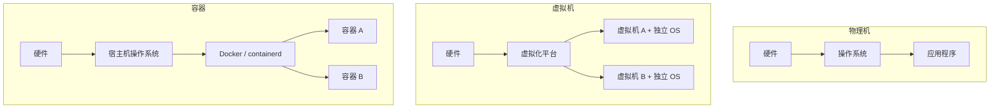
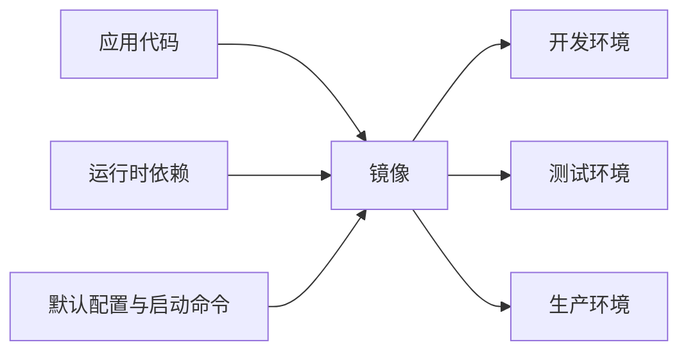
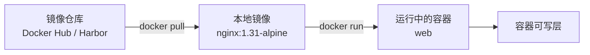
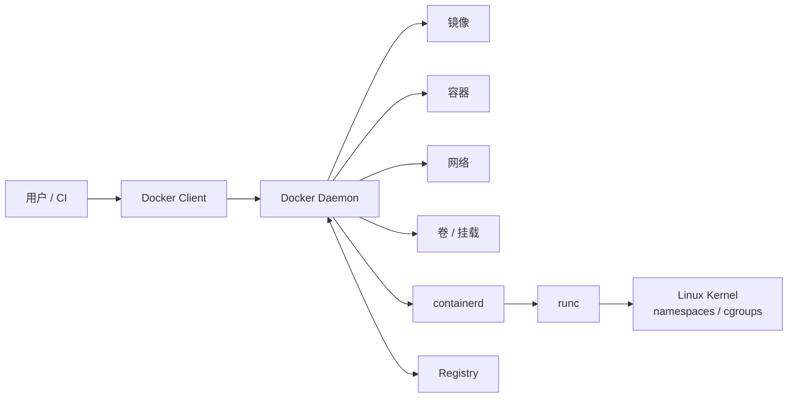
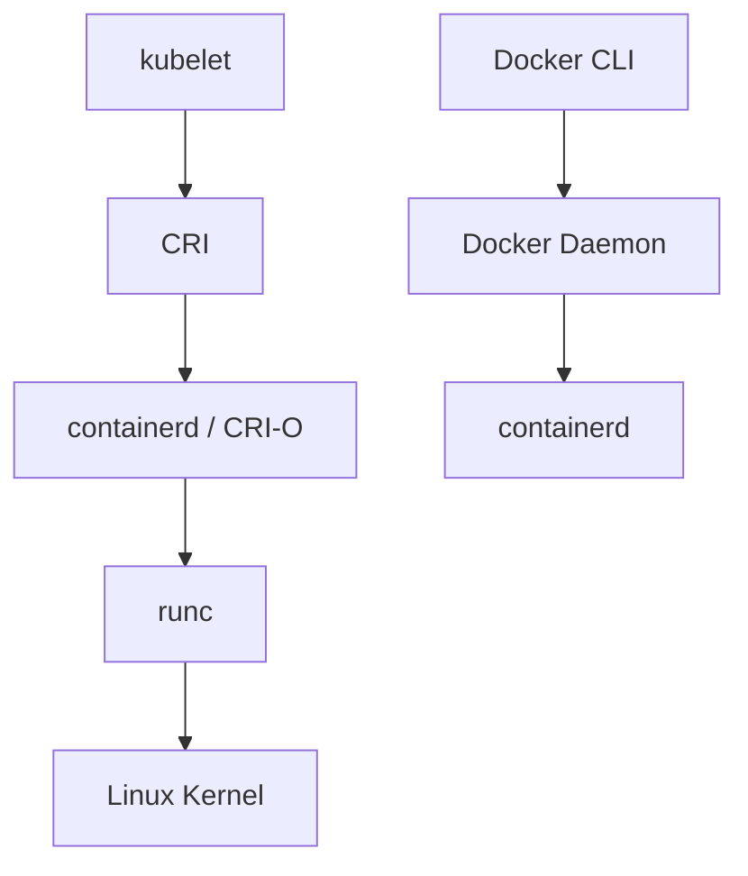

# 容器模型与运行时

容器将应用及其依赖封装为镜像，再由运行时在宿主机上创建隔离进程。镜像如何获取、标签如何管理见下一篇；本文只梳理容器的运行模型、Docker 的调用链路以及它与 Kubernetes 运行时的边界。

## 物理机、虚拟机与容器

物理机、虚拟机和容器都可以运行应用程序，但抽象层级和隔离方式不同。



| 对比项 | 物理机 | 虚拟机 | 容器 |
| --- | --- | --- | --- |
| 本质 | 真实硬件 | 虚拟出的完整计算机 | 被隔离的一组进程 |
| 操作系统 | 直接安装完整操作系统 | 每台虚拟机都有独立操作系统 | 共享宿主机内核 |
| 启动速度 | 慢 | 较慢 | 快 |
| 资源占用 | 高 | 中等偏高 | 低 |
| 隔离强度 | 最强 | 很强 | 较强 |
| 典型场景 | 专用设备、高性能负载 | 云服务器、测试环境 | 服务交付、CI/CD、批处理 |

容器并不包含独立内核，也不是一台完整的计算机。Linux 的 namespaces 隔离进程、网络、挂载、主机名等视图；cgroups 约束 CPU、内存和 I/O 等资源。两者共同提供进程级隔离，但不能替代虚拟机级隔离。

## 容器解决的问题

传统部署依赖操作系统版本、动态库、语言运行时、配置文件和启动脚本。开发环境能够运行的程序，在测试或生产环境失败，常常不是代码变化，而是这些运行依赖不一致。

容器的核心价值是把应用及其运行环境打包为镜像，再通过统一运行时启动。交付物不再只是源码或二进制，而是包含依赖、目录结构、默认命令和元数据的镜像。



镜像作为不可变交付物，便于复现同一运行环境；容器启动不需要加载完整操作系统；日志、健康检查、资源限制和生命周期管理也有统一入口。Web 服务、API 服务、批处理任务和 CI/CD 构建任务通常能够从这种交付方式获益。强依赖本地硬件、内核模块或复杂本地状态的系统仍需结合场景评估。

## 镜像、容器与仓库

- 镜像是包含应用、依赖、文件系统层、默认命令和元数据的只读模板；
- 容器是由镜像创建的运行实例；
- 仓库用于存储和分发镜像。



同一个镜像可以启动多个容器。各容器共享镜像的只读层，但各自拥有独立可写层；容器删除后，可写层中的数据默认也会删除。因此，配置和需要保留的数据应通过镜像、挂载、volume 或外部存储管理。

```bash
docker run -d --name my-nginx nginx:1.31-alpine
```

## Docker 架构调用链路

Docker 是面向构建和运行容器的工具体系。用户执行 `docker` 命令后，Docker Client 将请求发送给 Docker Daemon；Daemon 管理镜像、容器、网络和卷，并通过 containerd 与 runc 创建隔离进程。

| 组件 | 职责 |
| --- | --- |
| Docker Client | 执行 `docker` 命令并请求 Docker Daemon。 |
| Docker Daemon | 管理镜像、容器、网络、卷和构建任务。 |
| containerd | 管理镜像、快照、容器生命周期和运行时任务。 |
| runc | 按 OCI Runtime Specification 创建和启动容器进程。 |
| Registry | 存储和分发 OCI 镜像。 |



以 `docker run nginx:1.31-alpine` 为例，Docker 会检查本地镜像，必要时从仓库拉取镜像，然后准备网络、挂载、日志和资源限制，并通过底层运行时创建进程。命令无法连接通常属于 Client 到 Daemon 的问题；镜像拉取失败多与仓库、网络或认证有关；容器启动失败则需检查入口命令、配置、权限和运行时日志。

## 运行环境与版本基线

本章命令基于 Docker Engine 29.6.1 与随发行版提供的 Docker CLI 整理。Docker Desktop、Linux 发行版打包的 Engine，以及 rootless 模式的实际行为可能不同，执行前应以本机输出为准。

```bash
docker version
docker info
docker context ls
```

- `docker version` 分别显示 Client 与 Server 版本；只有 Client 信息通常表示 Daemon 未启动或当前用户无权访问 Socket。
- `docker info` 可查看存储驱动、日志驱动、cgroup 驱动、Docker 数据目录和镜像加速器等运行环境信息。

Docker Engine 29 在 Linux 全新安装时默认使用 containerd image store；由旧版本升级的环境可能继续使用原有存储驱动。实际存储实现应以 `docker info` 为准，而不应只根据版本号判断。

`docker info` 中较常用的字段如下：

| 字段 | 含义 |
| --- | --- |
| <code>Server&nbsp;Version</code> | Docker Engine 服务端版本。 |
| <code>Storage&nbsp;Driver</code> | 镜像与容器层的存储实现；经典存储驱动常见为 `overlay2`，启用 containerd image store 时常显示为 `overlayfs`。 |
| <code>Logging&nbsp;Driver</code> | 容器默认日志驱动，常见为 `json-file`。 |
| <code>Cgroup&nbsp;Driver</code> | Docker 使用的 cgroup 驱动；Kubernetes 节点上应与 kubelet 配置保持一致。 |
| <code>Docker&nbsp;Root&nbsp;Dir</code> | Docker 本地数据目录，Linux 上通常为 `/var/lib/docker`。 |
| <code>Registry&nbsp;Mirrors</code> | 已配置的镜像加速器地址。 |

## Docker 与 Kubernetes

Kubernetes 从 v1.24 起移除了 kubelet 内置的 dockershim。被移除的是 kubelet 适配 Docker Engine 的内部代码，不是 Docker 镜像格式；Docker 构建出的 OCI 镜像仍可由 containerd、CRI-O 等 CRI 运行时拉取和运行。



| 场景 | 常用工具 | 边界 |
| --- | --- | --- |
| 本地构建、测试容器 | `docker` | 管理 Docker Daemon 的对象。 |
| 管理 Kubernetes 资源 | `kubectl` | 管理 Pod、Deployment、Service 等 API 对象。 |
| 排查 Kubernetes 节点容器 | `crictl` | 通过 CRI 查询 kubelet 使用的运行时。 |
| 排查 containerd 底层对象 | `ctr` | 直接查看 containerd，对日常应用管理并不友好。 |

在使用 containerd 的 Kubernetes 节点上，不应默认用 `docker container ls` 排查 Pod。应优先使用 `kubectl get po -A` 和 `sudo crictl ps -a`；需要查看 containerd 对象时再使用 `sudo ctr -n k8s.io containers ls`。

## 隔离与权限边界

容器共享宿主机内核。内核漏洞、`--privileged`、宿主机敏感路径挂载和 Docker Socket 授权都会扩大风险。生产环境应使用非 root 用户运行应用，避免不必要的 `--privileged`、`--pid host`、`--network host` 和宿主机目录挂载，并结合镜像扫描、只读文件系统与资源限制控制风险。

## Docker Socket 与权限

Docker Client 通常通过 `/var/run/docker.sock` 访问 Docker Daemon。能够访问该 Socket 的用户可以请求 Daemon 创建高权限容器、挂载目录或访问主机资源，因此加入 `docker` 组不是低风险授权：

```bash
sudo usermod -aG docker "$USER"
newgrp docker
```

> [!WARNING]
> 不要在业务容器中挂载 `/var/run/docker.sock`，也不要把加入 `docker` 组视为低风险授权。它等价于授予用户很高的主机控制能力。

自动化系统需要构建镜像时，应使用隔离构建节点、专用账号和最小权限策略。若 `docker container ls` 报 `Cannot connect to the Docker daemon at unix:///var/run/docker.sock`，可按服务状态、服务日志、Socket 权限和用户组顺序检查：

```bash
sudo systemctl status docker --no-pager
sudo systemctl start docker
sudo journalctl -u docker -xe --no-pager
ls -l /var/run/docker.sock
id
```

Docker 服务正常但普通用户无权限时，可临时使用 `sudo docker container ls` 验证是否为权限问题；确认后再决定是否授予 `docker` 组权限。

## 参考

- [Docker Engine 29.6.1 release notes](https://docs.docker.com/engine/release-notes/29/#2961)
- [Docker Engine](https://docs.docker.com/engine/)
- [Docker CLI reference](https://docs.docker.com/reference/cli/docker/)
- [containerd image store with Docker Engine](https://docs.docker.com/engine/storage/containerd/)
- [Migrating from dockershim](https://kubernetes.io/docs/tasks/administer-cluster/migrating-from-dockershim/)
