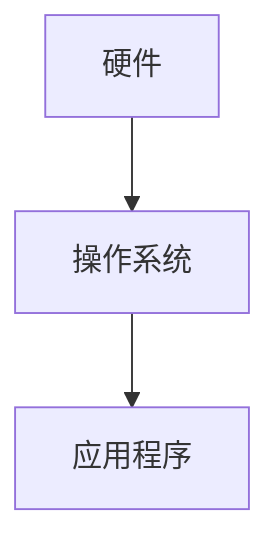
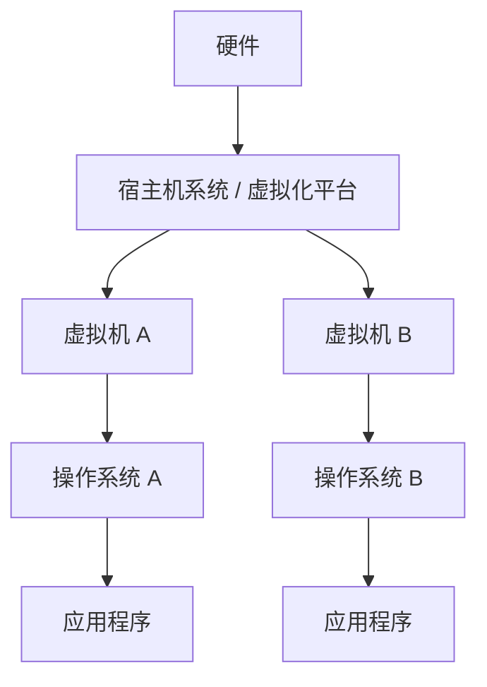
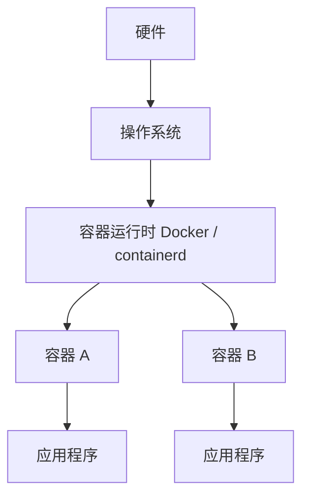

# 物理机、虚拟机与容器

物理机、虚拟机、容器都是运行程序的环境，但它们所在的层级不同。

> 物理机是真实硬件；虚拟机是在物理机上模拟出来的一整台电脑；容器是在操作系统里隔离出来的一组进程。

## 物理机

物理机也叫裸金属服务器，是真实存在的一台电脑或服务器。它有真实的 CPU、内存、硬盘、网卡、主板和电源，操作系统直接安装在硬件上。

特点：

- 性能最直接
- 隔离性依赖操作系统本身
- 资源利用率不够灵活
- 适合数据库、大型计算、高性能场景

## 虚拟机

虚拟机是在物理机上虚拟出来的一台电脑。一台物理机可以运行多个虚拟机，每个虚拟机都有自己的虚拟 CPU、虚拟内存、虚拟硬盘、虚拟网卡和独立操作系统。

特点：

- 每个虚拟机都有完整操作系统
- 隔离性强
- 启动比容器慢
- 占用资源比容器多
- 可以在同一台物理机上运行不同系统

## 容器

容器不是一台完整电脑，而是操作系统中隔离出来的一组进程。容器通常共享宿主机内核，但拥有相对独立的文件系统、进程空间、网络配置、环境变量和依赖库。

特点：

- 启动快
- 占用资源少
- 适合部署应用
- 隔离性强于普通进程，但弱于虚拟机
- Linux 容器共享宿主机 Linux 内核

## 对比表

| 对比项 | 物理机 | 虚拟机 | 容器 |
| --- | --- | --- | --- |
| 本质 | 真实硬件 | 虚拟出来的一台电脑 | 隔离出来的一组进程 |
| 完整操作系统 | 有 | 有 | 通常没有 |
| 独立内核 | 有 | 有 | 一般共享宿主机内核 |
| 启动速度 | 慢 | 较慢 | 很快 |
| 资源占用 | 高 | 中等偏高 | 低 |
| 隔离性 | 最强 | 很强 | 较强 |
| 常见用途 | 高性能服务、数据库 | 云服务器、测试环境 | 应用部署、微服务、CI/CD |
