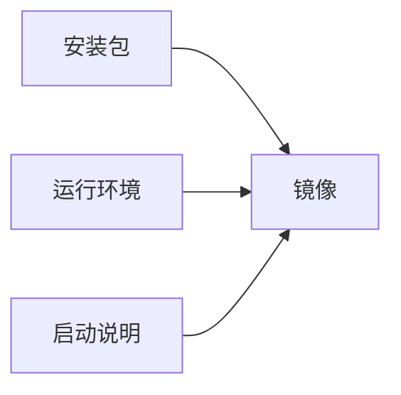
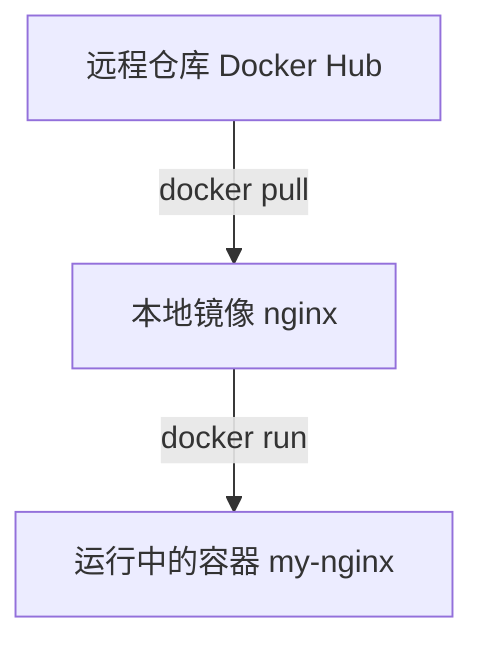

# 镜像、容器与镜像仓库

Docker 世界里有三个核心概念：镜像是模板，容器是运行起来的实例，仓库是存放镜像的地方。

## 镜像 Image

镜像是一个只读模板，里面打包了运行应用需要的内容：

- 应用代码
- 运行时环境
- 系统依赖
- 配置文件
- 启动命令

可以理解为：



## 容器 Container

容器是由镜像创建并运行起来的实例。如果镜像像安装包或模板，那么容器就是正在运行的程序环境。

```bash
docker run -d --name my-nginx nginx
```

这条命令表示：使用 `nginx` 镜像创建并启动一个叫 `my-nginx` 的容器。

一个镜像可以创建多个容器，每个容器都有自己的运行状态和可写层。

## 仓库 Repository / Registry

仓库是存放镜像的地方。你可以从仓库下载镜像，也可以把自己制作的镜像上传到仓库。

常见镜像仓库：

- Docker Hub
- Harbor
- GitHub Container Registry
- 阿里云容器镜像服务
- 腾讯云 TCR
- AWS ECR

## 三者关系



简单记忆：仓库存镜像，镜像起容器，容器跑应用。
