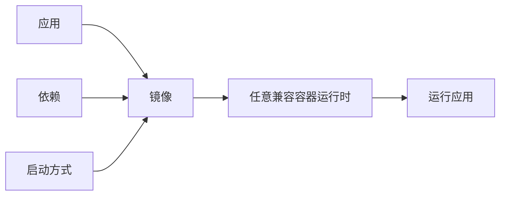

# 为什么要使用容器

容器的核心价值是把应用和运行环境打包到一起，让交付、部署和运行更加一致。

## 一次构建，到处运行

传统部署经常遇到这类问题：开发环境能跑，测试环境报错，生产环境缺依赖。容器把应用、运行时、依赖库、配置和启动命令一起封装进镜像，大幅降低环境差异。

## 更强的一致性

容器镜像是不可变交付物。只要镜像 digest 一样，运行内容就是一样的。这比临时在机器上安装依赖、修改配置更可靠。

## 可移植性强

同一个镜像可以在不同环境运行：

- 本地 Docker
- 测试环境
- 生产服务器
- Kubernetes 集群
- CI/CD 流水线

## 提升资源利用率

容器共享宿主机内核，不需要像虚拟机一样为每个应用启动完整操作系统，因此启动更快、资源占用更少。

## 更细粒度的隔离

通常一个容器只运行一个主要进程，便于资源限制、日志收集、健康检查和生命周期管理。

## 适合场景

容器尤其适合 Web 服务、微服务、API 服务、批处理任务、CI/CD 构建任务，以及可水平扩展的无状态应用。
