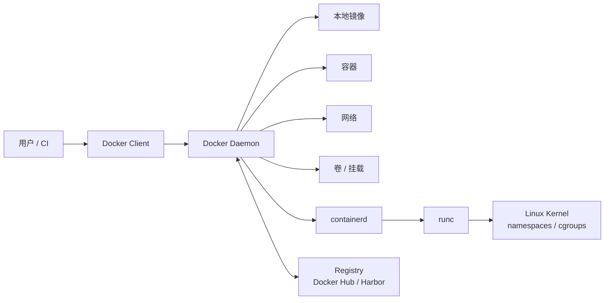

# Docker 组件与架构

Docker 是一个开源容器引擎，可以把应用以及依赖项打包成可移植镜像，并运行在支持容器的环境中。

## 核心组件

- Docker Client：Docker 客户端，用于执行 `docker` 命令。
- Docker Daemon：Docker 守护进程，负责构建镜像、运行容器、管理网络和存储。
- Docker Image：Docker 镜像，相当于一个模板，可以用来启动容器。
- Docker Container：Docker 容器，由镜像启动，容器内运行应用程序。
- Docker Registry：镜像仓库，用于存储和分发镜像。

## 架构图

## 命令执行链路

以 `docker run nginx` 为例：

1. Docker Client 把请求发给 Docker Daemon。
2. Docker Daemon 检查本地是否有 `nginx` 镜像。
3. 如果没有镜像，就从 Registry 拉取。
4. Docker Daemon 调用 containerd 管理容器生命周期。
5. containerd 通过 runc 创建真正的 Linux 容器进程。
