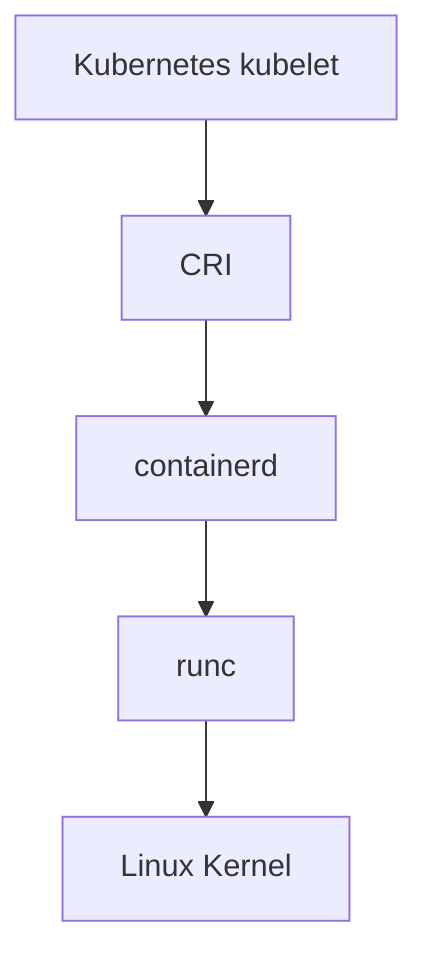
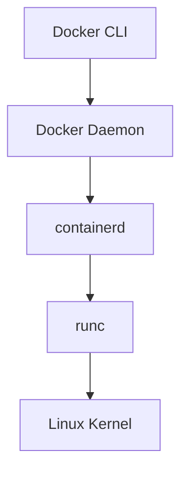

# Docker 与 Kubernetes 运行时关系

Kubernetes 在 v1.24 后不再使用内置 dockershim，而是直接通过 CRI 对接 containerd、CRI-O 等容器运行时。

## Kubernetes 的运行时链路



Docker 的链路是：



两者底层都可能使用 containerd 和 runc，但管理入口和命名空间不同。

## 为什么还要学 Docker

即使 Kubernetes 不再直接使用 Docker，Docker 仍然重要：

- Docker 依旧是镜像构建和产品交付的常用工具。
- Docker 依旧是本地开发和测试的首选工具之一。
- Docker 镜像符合 OCI 标准，依旧可以被 Kubernetes 使用。
- 很多企业仍然用 Docker 或 Docker Compose 运行非 K8s 服务。

## OCI、containerd、runc

- OCI：Open Container Initiative，围绕容器镜像格式和运行时制定开放标准。
- containerd：容器运行时，负责镜像、容器、快照、生命周期等管理能力。
- runc：OCI runtime 的常见实现，负责创建容器进程和设置 namespace、cgroup 等隔离能力。

## 排查视角

Kubernetes Pod 不建议用 `docker ps` 排查，应使用：

```bash
kubectl get pods -A
sudo crictl ps -a
sudo ctr -n k8s.io containers ls
```
