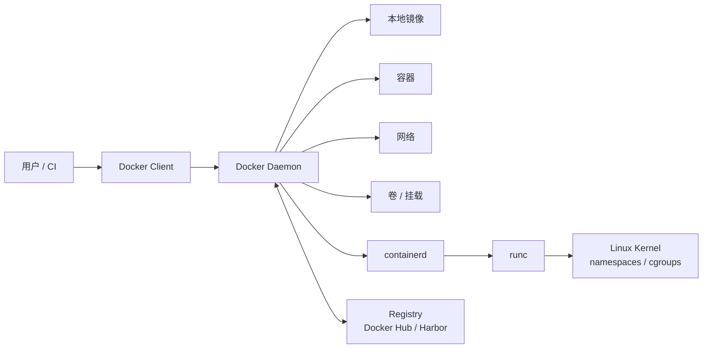
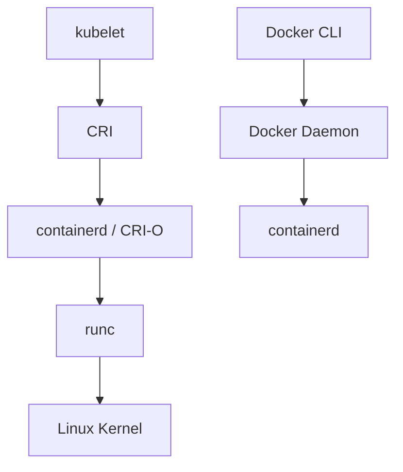

# Docker 架构与运行时

Docker 是一个面向开发、构建和运行容器的工具体系。本文不只记录命令，还记录 Docker Client、Docker Daemon、containerd、runc 和 Linux 内核之间的调用关系。

这一层知识会直接影响后续对 Kubernetes 运行时的理解。Kubernetes 不再通过内置 dockershim 直接对接 Docker Engine，但 Docker 构建出的 OCI 镜像仍然可以被 containerd、CRI-O 等 CRI 运行时正常拉取和运行。

## Docker 核心组件

| 组件               | 职责                                   |
|------------------|--------------------------------------|
| Docker Client    | 执行 `docker` 命令，并将请求发送给 Docker Daemon |
| Docker Daemon    | 负责镜像构建、镜像管理、容器运行、网络和存储管理             |
| Docker Image     | 应用运行环境的只读模板，用于创建容器                   |
| Docker Container | 由镜像创建的运行实例，内部运行应用进程                  |
| Docker Registry  | 存储和分发镜像的远程服务                         |
| containerd       | 管理镜像拉取、快照、容器生命周期和运行时任务               |
| runc             | OCI 标准运行时，根据 OCI runtime spec 创建隔离进程 |

Docker Daemon 是 Docker Engine 的核心服务。用户通过 `docker` 命令与 Daemon 通信，Daemon 再调用更底层的 containerd 和 runc 完成容器创建。

Docker Engine 29.0 起，Linux 全新安装默认使用 containerd image store 管理镜像；从早期版本升级的环境会继续使用原有经典存储驱动，除非手动启用 containerd image store。实际环境应以 `docker info` 输出为准。

## 架构调用链路



以 `docker run nginx:1.27-alpine` 为例，调用过程可以拆分为以下步骤：

1. Docker Client 将运行请求发送给 Docker Daemon。
2. Docker Daemon 检查本地是否存在目标镜像。
3. 如果镜像不存在，Docker Daemon 从 Registry 拉取镜像。
4. Docker Daemon 准备网络、挂载、日志、资源限制等配置。
5. Docker Daemon 调用 containerd 管理容器生命周期。
6. containerd 调用 runc，由 runc 根据 OCI runtime spec 使用 Linux namespaces 与 cgroups 创建隔离进程。

理解这条链路后，排查问题时可以按层定位：命令无法连接通常是 Client 到 Daemon 的问题；镜像拉取失败通常与 Registry、网络或认证有关；容器启动失败则可能出现在镜像入口命令、挂载、权限或运行时层。

## 查看运行环境

查看 Docker 客户端和服务端版本：

```bash
docker version
```

输出通常分为 `Client` 和 `Server` 两部分。`Server` 部分除 Docker Engine 版本外，还会列出 containerd、runc 组件的版本和 `OS/Arch`，与前文的调用链路对应。若只有客户端信息，通常说明 Docker Daemon 未启动，或当前用户没有访问 Docker Socket 的权限。

查看 Docker 运行环境：

```bash
docker info
```

常见关注字段如下：

| 字段                 | 含义                                                                            |
|--------------------|-------------------------------------------------------------------------------|
| `Server Version`   | Docker Engine 版本                                                              |
| `Storage Driver`   | 镜像和容器层使用的存储驱动，经典存储驱动常见为 `overlay2`，启用 containerd image store 时显示为 `overlayfs` |
| `Logging Driver`   | 日志驱动，默认常见为 `json-file`                                                        |
| `Cgroup Driver`    | cgroup 驱动，Kubernetes 节点上应与 kubelet 保持一致                                       |
| `Docker Root Dir`  | Docker 本地数据目录，Linux 默认通常为 `/var/lib/docker`                                   |
| `Registry Mirrors` | 镜像加速器配置                                                                       |

查看 Docker 当前管理的对象：

```bash
docker image ls
docker container ls -a
docker network ls
docker volume ls
```

这些对象分别对应镜像、容器、网络和数据卷。后续排查时，很多问题都可以通过这些对象之间的关联关系定位。

## Docker 与 Kubernetes 的关系

Kubernetes 从 v1.24 起移除了内置 dockershim。移除的是 kubelet 内部用于适配 Docker Engine 的特殊代码，并不是移除对 Docker 镜像的支持。



Docker 构建出的镜像符合 OCI 镜像规范，推送到镜像仓库后，Kubernetes 使用的 containerd 或 CRI-O 可以正常拉取并运行。也就是说，本地仍然可以使用 Docker 构建、测试和推送镜像，而 Kubernetes 节点可以使用 containerd 作为运行时。

| 场景                 | 常用工具      | 说明                              |
|--------------------|-----------|---------------------------------|
| 本地构建和运行容器          | `docker`  | 面向开发、调试和镜像制作                    |
| 管理 Kubernetes 对象   | `kubectl` | 面向 Pod、Deployment、Service 等集群资源 |
| 排查 Kubernetes 节点容器 | `crictl`  | 通过 CRI 查询 kubelet 使用的运行时        |
| 排查 containerd 底层对象 | `ctr`     | 接近底层，适合定位 containerd 视角问题       |

## Kubernetes 节点排查视角

在 Kubernetes 节点上排查 Pod 时，不应默认使用 `docker ps`。原因是 Docker Daemon 管理的容器和 kubelet 通过 CRI 管理的容器并不一定在同一管理入口中。

对于使用 containerd 的 Kubernetes 节点，Pod 通常位于 containerd 的 `k8s.io` 命名空间。排查时应优先使用：

```bash
kubectl get pods -A
sudo crictl ps -a
sudo crictl pods
sudo ctr -n k8s.io containers ls
```

确认运行时名称、版本，以及 kubelet 使用的运行时端点：

```bash
sudo crictl version
ps -ef | grep kubelet | grep container-runtime-endpoint
```

如果 `crictl` 提示未配置运行时端点，应参考第 01 章创建 `/etc/crictl.yaml`，并确认 endpoint 指向当前节点实际使用的 containerd Socket。

## Docker Socket 与权限

Docker Client 通常通过 `/var/run/docker.sock` 与 Docker Daemon 通信。能够访问该 Socket 的用户，实际上可以让 Docker Daemon 以较高权限在宿主机上创建容器、挂载目录或访问主机资源。

因此，加入 `docker` 组并不是普通的低风险授权：

```bash
sudo usermod -aG docker "$USER"
newgrp docker
```

生产环境中应谨慎授予 Docker Socket 访问权限，避免在业务容器中挂载 `/var/run/docker.sock`。如果必须让自动化系统构建镜像，应优先使用隔离的构建节点、专用账号和最小权限策略。

## 常见问题

执行 `docker ps` 时出现以下错误：

```text
Cannot connect to the Docker daemon at unix:///var/run/docker.sock
```

可按顺序检查 Docker 服务状态、服务日志、Socket 权限和当前用户组：

```bash
sudo systemctl status docker --no-pager
sudo systemctl start docker
sudo journalctl -u docker -xe --no-pager
ls -l /var/run/docker.sock
id
```

如果 Docker 服务正常但普通用户无权限，可临时使用 `sudo docker ps` 验证问题是否与权限有关。确认后再决定是否将用户加入 `docker` 组。
