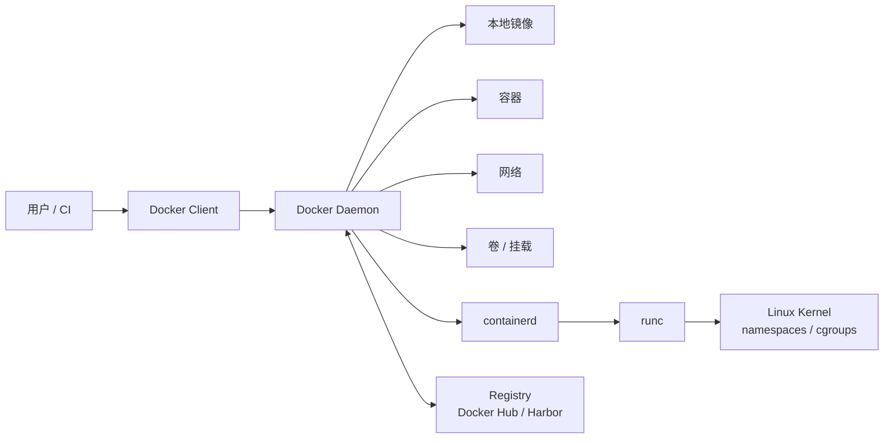
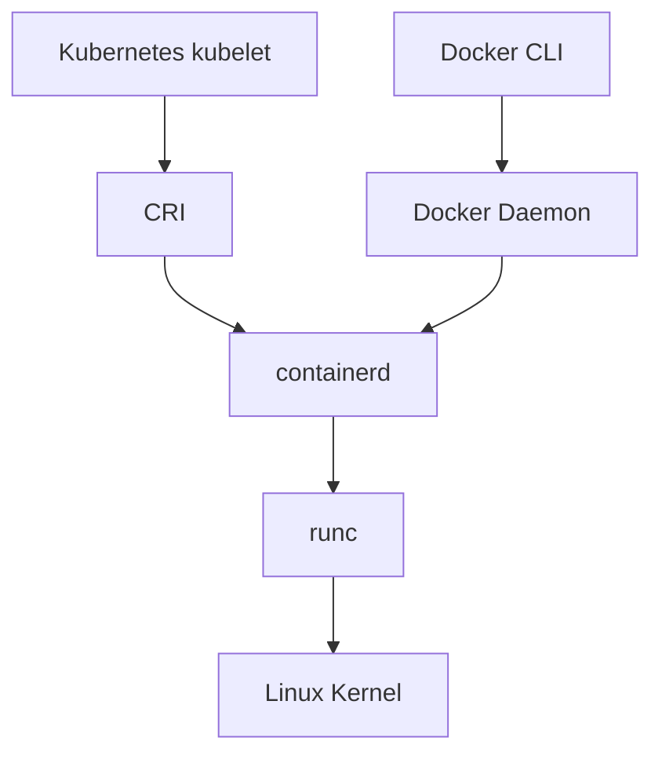

# Docker 架构与运行时

Docker 是一个开源容器引擎，可以把应用以及依赖项打包成可移植镜像，并运行在支持容器的环境中。学习 Docker 时，不能只记命令，还要理解命令背后的组件链路。

## Docker 核心组件

| 组件 | 作用 |
| --- | --- |
| Docker Client | Docker 客户端，用于执行 `docker` 命令 |
| Docker Daemon | Docker 守护进程，负责构建镜像、运行容器、管理网络和存储 |
| Docker Image | 镜像，相当于一个模板，可以用来启动容器 |
| Docker Container | 容器，由镜像启动，容器内运行应用程序 |
| Docker Registry | 镜像仓库，用于存储和分发镜像 |
| containerd | 底层容器运行时，管理镜像、容器、快照和生命周期 |
| runc | OCI runtime，负责创建真正的 Linux 容器进程 |

## Docker 架构图



以 `docker run nginx` 为例：

1. Docker Client 把请求发给 Docker Daemon。
2. Docker Daemon 检查本地是否有 `nginx` 镜像。
3. 如果没有镜像，就从 Registry 拉取。
4. Docker Daemon 调用 containerd 管理容器生命周期。
5. containerd 通过 runc 创建真正的 Linux 容器进程。

## 观察 Docker 环境

查看客户端与服务端版本：

```bash
docker version
```

重点关注输出中的 `Client` 和 `Server`。如果只有客户端信息，通常说明 Docker Daemon 没有启动，或者当前用户没有访问 Docker Socket 的权限。

查看 Docker 运行环境：

```bash
docker info
```

常见关注项：

| 字段 | 含义 |
| --- | --- |
| `Server Version` | Docker Engine 版本 |
| `Storage Driver` | 镜像和容器层使用的存储驱动，Linux 常见为 `overlay2` |
| `Logging Driver` | 日志驱动，默认常见为 `json-file` |
| `Cgroup Driver` | cgroup 驱动，Kubernetes 节点上通常关注是否与 kubelet 一致 |
| `Docker Root Dir` | Docker 本地数据目录，默认常见为 `/var/lib/docker` |
| `Registry Mirrors` | 镜像加速器配置 |

查看 Docker 管理的对象：

```bash
docker image ls
docker container ls -a
docker network ls
docker volume ls
```

## Docker 与 Kubernetes 的关系

Kubernetes 在 v1.24 后不再使用内置 dockershim，而是直接通过 CRI 对接 containerd、CRI-O 等容器运行时。

这并不表示 Docker 镜像不能在 Kubernetes 中使用。Docker 构建出来的镜像符合 OCI 镜像规范，只要推送到镜像仓库，containerd、CRI-O 等运行时都可以拉取并运行。



两者底层都可能使用 containerd 和 runc，但管理入口和命名空间不同。

| 场景 | 常用入口 | 说明 |
| --- | --- | --- |
| 本地构建和运行容器 | `docker` | 面向开发和镜像制作，体验友好 |
| Kubernetes 管理 Pod | `kubectl` | 面向集群对象，不直接关心底层容器进程 |
| Kubernetes 节点排查容器 | `crictl` | 通过 CRI 查询 kubelet 使用的运行时 |
| containerd 底层排查 | `ctr` | 更底层，输出不如 `crictl` 贴近 Kubernetes |

## 为什么还要学 Docker

即使 Kubernetes 不再直接使用 Docker，Docker 仍然重要：

- Docker 依旧是镜像构建和产品交付的常用工具。
- Docker 依旧是本地开发和测试的首选工具之一。
- Docker 镜像符合 OCI 标准，依旧可以被 Kubernetes 使用。
- 很多企业仍然用 Docker 或 Docker Compose 运行非 K8s 服务。

## 排查视角

Kubernetes Pod 不建议用 `docker ps` 排查。原因是 Kubernetes 使用的 containerd 命名空间通常是 `k8s.io`，Docker CLI 默认只能看到 Docker Daemon 自己管理的容器。

排查 Pod 时优先使用：

```bash
kubectl get pods -A
sudo crictl ps -a
sudo ctr -n k8s.io containers ls
```

查看 kubelet 当前使用的运行时端点：

```bash
sudo crictl info | grep -E 'runtimeName|runtimeVersion'
ps -ef | grep kubelet | grep container-runtime-endpoint
```

如果 `crictl` 提示没有配置运行时端点，可以创建：

```bash
sudo tee /etc/crictl.yaml >/dev/null <<'EOF'
runtime-endpoint: unix:///run/containerd/containerd.sock
image-endpoint: unix:///run/containerd/containerd.sock
timeout: 10
debug: false
EOF
```

## 常见问题

如果执行 `docker ps` 提示无法连接：

```text
Cannot connect to the Docker daemon at unix:///var/run/docker.sock
```

通常检查：

```bash
sudo systemctl status docker
sudo systemctl start docker
ls -l /var/run/docker.sock
```

普通用户执行 Docker 命令如果提示权限不足，可以加入 `docker` 组：

```bash
sudo usermod -aG docker "$USER"
newgrp docker
```

加入 `docker` 组等价于给用户较高的主机控制权限，生产环境要谨慎授权。

## 本节回顾

- Docker Client 只负责发起请求，真正管理镜像和容器的是 Docker Daemon。
- Docker Daemon 会继续调用 containerd 和 runc 创建容器进程。
- Kubernetes 不再依赖内置 dockershim，但仍然可以运行 Docker 构建的 OCI 镜像。
- 排查 Kubernetes 节点容器时优先使用 `kubectl` 和 `crictl`。

