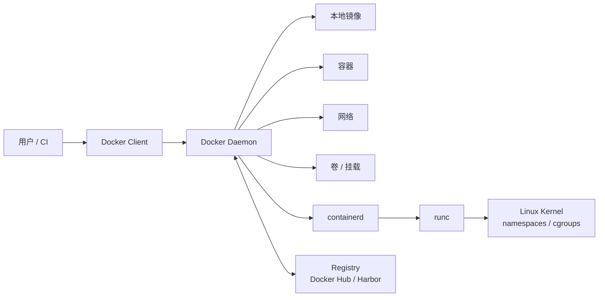

# Docker 组件与架构

Docker 是一个开源容器引擎，可以把应用以及依赖项打包成可移植镜像，并运行在支持容器的环境中。

学完本节后，应能回答三个问题：

- `docker` 命令到底发给了谁。
- 镜像、容器、网络、卷分别由哪个组件管理。
- Docker 与 containerd、runc 的关系是什么。

## 核心组件

- Docker Client：Docker 客户端，用于执行 `docker` 命令。
- Docker Daemon：Docker 守护进程，负责构建镜像、运行容器、管理网络和存储。
- Docker Image：Docker 镜像，相当于一个模板，可以用来启动容器。
- Docker Container：Docker 容器，由镜像启动，容器内运行应用程序。
- Docker Registry：镜像仓库，用于存储和分发镜像。

## 架构图



## 命令执行链路

以 `docker run nginx` 为例：

1. Docker Client 把请求发给 Docker Daemon。
2. Docker Daemon 检查本地是否有 `nginx` 镜像。
3. 如果没有镜像，就从 Registry 拉取。
4. Docker Daemon 调用 containerd 管理容器生命周期。
5. containerd 通过 runc 创建真正的 Linux 容器进程。

## 常用观察命令

查看客户端与服务端版本：

```bash
docker version
```

重点关注输出中的 `Client` 和 `Server`。如果只有客户端信息，通常说明 Docker Daemon 没有启动，或者当前用户没有访问 Docker Socket 的权限。

查看 Docker 运行环境：

```bash
docker info
```

常见关注项：

| 字段 | 含义 |
| --- | --- |
| `Server Version` | Docker Engine 版本 |
| `Storage Driver` | 镜像和容器层使用的存储驱动，Linux 常见为 `overlay2` |
| `Cgroup Driver` | cgroup 驱动，Kubernetes 节点上通常关注是否与 kubelet 一致 |
| `Docker Root Dir` | Docker 本地数据目录，默认常见为 `/var/lib/docker` |
| `Registry Mirrors` | 镜像加速器配置 |

查看 Docker 管理的对象：

```bash
docker image ls
docker container ls -a
docker network ls
docker volume ls
```

这些对象都由 Docker Daemon 维护。容器真正运行时仍会继续调用更底层的 containerd 和 runc。

## 常见问题

如果执行 `docker ps` 提示无法连接：

```text
Cannot connect to the Docker daemon at unix:///var/run/docker.sock
```

通常检查：

```bash
sudo systemctl status docker
sudo systemctl start docker
ls -l /var/run/docker.sock
```

如果是普通用户权限不足，可以临时使用 `sudo docker ps`。把用户加入 `docker` 组虽然方便，但等价于授予较高主机权限，生产服务器上应谨慎开放。

## 本章回顾

- Docker Client 只负责发起请求，真正管理镜像和容器的是 Docker Daemon。
- Docker Daemon 会继续调用 containerd 和 runc 创建容器进程。
- Docker 的镜像、容器、网络、卷是四类核心对象，排查时要分别查看。
- `docker info` 是理解当前 Docker 环境最重要的入口命令之一。
