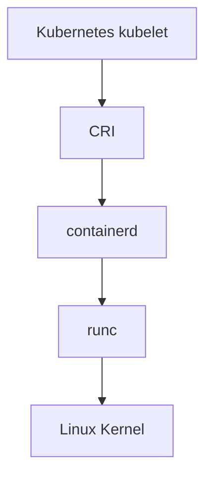
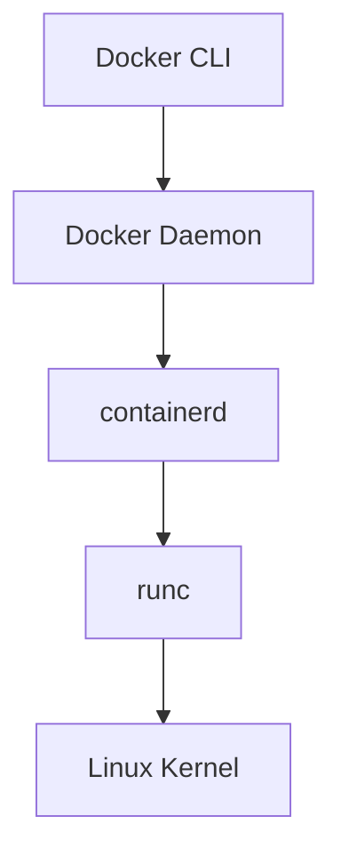

# Docker 与 Kubernetes 运行时关系

Kubernetes 在 v1.24 后不再使用内置 dockershim，而是直接通过 CRI 对接 containerd、CRI-O 等容器运行时。

这并不表示 Docker 镜像不能在 Kubernetes 中使用。Docker 构建出来的镜像符合 OCI 镜像规范，只要推送到镜像仓库，containerd、CRI-O 等运行时都可以拉取并运行。

## Kubernetes 的运行时链路



Docker 的链路是：



两者底层都可能使用 containerd 和 runc，但管理入口和命名空间不同。

| 场景 | 常用入口 | 说明 |
| --- | --- | --- |
| 本地构建和运行容器 | `docker` | 面向开发和镜像制作，体验友好 |
| Kubernetes 管理 Pod | `kubectl` | 面向集群对象，不直接关心底层容器进程 |
| Kubernetes 节点排查容器 | `crictl` | 通过 CRI 查询 kubelet 使用的运行时 |
| containerd 底层排查 | `ctr` | 更底层，输出不如 `crictl` 贴近 Kubernetes |

## 为什么还要学 Docker

即使 Kubernetes 不再直接使用 Docker，Docker 仍然重要：

- Docker 依旧是镜像构建和产品交付的常用工具。
- Docker 依旧是本地开发和测试的首选工具之一。
- Docker 镜像符合 OCI 标准，依旧可以被 Kubernetes 使用。
- 很多企业仍然用 Docker 或 Docker Compose 运行非 K8s 服务。

## OCI、containerd、runc

- OCI：Open Container Initiative，围绕容器镜像格式和运行时制定开放标准。
- containerd：容器运行时，负责镜像、容器、快照、生命周期等管理能力。
- runc：OCI runtime 的常见实现，负责创建容器进程和设置 namespace、cgroup 等隔离能力。

## 排查视角

Kubernetes Pod 不建议用 `docker ps` 排查。原因是 Kubernetes 使用的 containerd 命名空间通常是 `k8s.io`，Docker CLI 默认只能看到 Docker Daemon 自己管理的容器。

排查 Pod 时优先使用：

```bash
kubectl get pods -A
sudo crictl ps -a
sudo ctr -n k8s.io containers ls
```

查看 kubelet 当前使用的运行时端点：

```bash
sudo crictl info | grep -E 'runtimeName|runtimeVersion'
ps -ef | grep kubelet | grep container-runtime-endpoint
```

如果 `crictl` 提示没有配置运行时端点，可以创建：

```bash
sudo tee /etc/crictl.yaml >/dev/null <<'EOF'
runtime-endpoint: unix:///run/containerd/containerd.sock
image-endpoint: unix:///run/containerd/containerd.sock
timeout: 10
debug: false
EOF
```

再次验证：

```bash
sudo crictl info
sudo crictl images
```

## 版本注意事项

- Kubernetes v1.24 起移除了内置 dockershim，节点运行时应优先使用 containerd 或 CRI-O。
- 旧文章中“安装 Kubernetes 必须安装 Docker”的说法已经过时。
- 如果确实想让 Kubernetes 对接 Docker Engine，需要额外组件 cri-dockerd，但新集群不建议把它作为默认选择。
- Docker 仍适合用于开发机镜像构建、单机服务验证和 Docker Compose 场景。

## 本章回顾

- Kubernetes 不再依赖内置 dockershim，但仍然可以运行 Docker 构建的 OCI 镜像。
- Docker、containerd、runc 是不同层次的组件，不应混成一个概念。
- 排查 Kubernetes 节点容器时优先使用 `kubectl` 和 `crictl`。
- 旧版 Docker shim 资料需要结合 Kubernetes 版本判断是否仍然适用。
