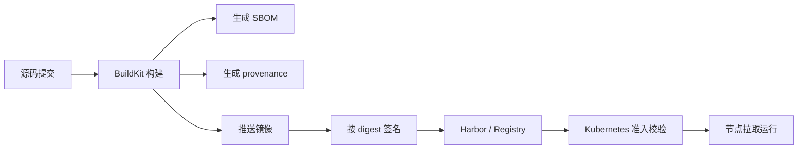

# 镜像供应链安全

镜像仓库不仅保存镜像层和标签，也保存镜像来源、构建过程、依赖清单和准入结果等安全上下文。镜像供应链安全关注的是镜像从源码、构建、签名、分发到集群准入之间的可信链路，而不是单独依赖某一次漏洞扫描。

## 基本边界

镜像供应链安全可以拆成四类对象：

| 对象 | 解决的问题 | 不负责的范围 |
| --- | --- | --- |
| SBOM | 记录镜像包含的软件包、版本、许可证和包标识 | 不判断镜像是否可信，也不替代漏洞扫描 |
| 签名 | 证明某个主体对镜像或制品摘要进行了签署 | 不证明镜像内容没有漏洞 |
| Provenance | 记录镜像由什么构建器、源码、参数和材料构建出来 | 不保证运行时配置符合安全策略 |
| 准入校验 | 在 Kubernetes API 写入前拒绝不符合策略的 Pod | 不会扫描节点上已经存在的镜像层 |

这几类对象通常围绕镜像 digest 建立关系。标签可以移动，digest 才能稳定定位某个镜像内容；供应链记录、签名和策略判断都应尽量绑定 digest。

## SBOM

SBOM 是 Software Bill of Materials，用于描述镜像中包含的软件制品。它通常记录包名、版本、许可证、包标识和文件关系，便于后续做漏洞匹配、许可证审计和影响面分析。

Docker BuildKit 支持在构建时生成 SBOM attestation：

```bash
docker buildx build \
  --tag harbor.example.com/business/api-server:v1.0.0 \
  --sbom=true \
  --push .
```

`--sbom=true` 是 `--attest type=sbom` 的简写。生成的 SBOM 以 attestation 形式附着在镜像索引上，推送到支持相关 OCI 制品的仓库后，可以在不拉取完整镜像的情况下查看元数据。

多阶段构建中，默认 SBOM 主要面向最终镜像阶段。构建阶段依赖如果不会进入最终镜像，可能不会出现在最终 SBOM 中；需要记录构建阶段依赖时，应显式配置 BuildKit 的 SBOM 扫描范围。

## 构建 Provenance

Provenance 记录镜像如何被构建，包括构建器、构建参数、上下文来源、依赖材料和平台信息。它用于回答“这个镜像是不是由预期流水线和预期源码构建出来”的问题。

Docker BuildKit 默认会为构建结果生成最小级别的 provenance attestation。需要更完整记录时，可以显式使用 `mode=max`：

```bash
docker buildx build \
  --tag harbor.example.com/business/api-server:v1.0.0 \
  --provenance=mode=max \
  --push .
```

如果使用 Docker Engine 默认 image store，attestation 通常需要直接推送到 Registry 才能保留；本地 `docker images` 视图不能作为 provenance 是否存在的判断依据。

## 镜像签名

镜像签名通常对镜像 digest 进行签署。签名对象不应只写标签，因为标签可以重新指向不同内容。

使用 Cosign 签名时，命令形式如下：

```bash
cosign sign harbor.example.com/business/api-server@sha256:<digest>
```

验证签名时，也应使用 digest：

```bash
cosign verify harbor.example.com/business/api-server@sha256:<digest>
```

签名只能说明该摘要被指定身份或密钥签署过。它不代表镜像没有漏洞，也不代表运行参数、权限、网络访问和 Secret 注入是安全的。生产链路中，签名应与 SBOM、漏洞扫描、来源证明和准入策略组合使用。

## 准入校验

Kubernetes 准入控制发生在请求通过认证和授权之后、对象持久化之前。它可以修改或拒绝创建、更新、删除等写请求，不会拦截 `get`、`list`、`watch` 这类读请求。

镜像相关的准入方式常见有三类：

| 方式 | 说明 | 适用边界 |
| --- | --- | --- |
| `AlwaysPullImages` | 将新建 Pod 的镜像拉取策略改为 `Always`，确保启动前重新拉取并检查凭据 | 多租户集群中避免复用节点上已有私有镜像 |
| `ImagePolicyWebhook` | API Server 调用外部 HTTPS Webhook，由外部服务决定镜像是否允许 | 需要自建镜像策略服务，且该 API 仍使用 `imagepolicy.k8s.io/v1alpha1` |
| `ValidatingAdmissionPolicy` / Webhook | 使用 CEL 或外部准入服务校验镜像字段、标签、digest 或注解 | 适合表达“必须使用指定仓库、必须带 digest、必须符合签名策略”等规则 |

`ImagePolicyWebhook` 能直接处理镜像准入，但它依赖外部策略服务和 alpha 版本的 `ImageReview` 对象。实际生产中，也可以使用 ValidatingAdmissionWebhook、ValidatingAdmissionPolicy 或 Sigstore Policy Controller 等组件，把签名、来源和仓库范围转化为准入规则。

> 注意：`imagepolicy.k8s.io/v1alpha1` API 仍在 alpha 阶段，未进入稳定版本。生产环境如果对 API 稳定性要求较高，可优先采用 ValidatingAdmissionPolicy 或 ValidatingAdmissionWebhook 方案。

## 流水线位置

镜像供应链信息应在构建流水线中生成，并在发布前完成校验：



Harbor 可以保存镜像和部分 OCI 制品，并提供漏洞扫描、复制、权限和审计能力；签名策略、准入控制和构建证明的完整闭环，通常还需要构建系统、签名系统和 Kubernetes 准入组件共同完成。

## 记录要点

- 发布记录中同时保存 tag 和 digest，回滚、签名、准入判断以 digest 为准。
- 构建时生成 SBOM 和 provenance，避免事后无法还原构建输入。
- 构建密钥使用 BuildKit secret 或 SSH mount，不通过 `ARG`、`ENV` 写入镜像层。
- 私有镜像使用最小权限 Robot 账号拉取，避免在集群中复用管理员凭据。
- 准入策略先在审计或告警模式验证，再逐步切换为拒绝模式。

## 参考

- [Docker Build attestations](https://docs.docker.com/build/metadata/attestations/)
- [Docker SBOM attestations](https://docs.docker.com/build/metadata/attestations/sbom/)
- [Docker SLSA provenance](https://docs.docker.com/build/metadata/attestations/slsa-provenance/)
- [Docker buildx build reference](https://docs.docker.com/reference/cli/docker/buildx/build/)
- [Kubernetes Admission Control](https://kubernetes.io/docs/reference/access-authn-authz/admission-controllers/)
- [Kubernetes ValidatingAdmissionPolicy](https://kubernetes.io/docs/reference/access-authn-authz/validating-admission-policy/)
- [Cosign signing containers](https://docs.sigstore.dev/cosign/signing/signing_with_containers/)
- [Cosign verify containers](https://docs.sigstore.dev/cosign/verifying/verify/)
- [Sigstore Policy Controller](https://docs.sigstore.dev/policy-controller/overview/)
