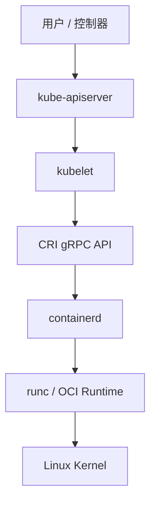
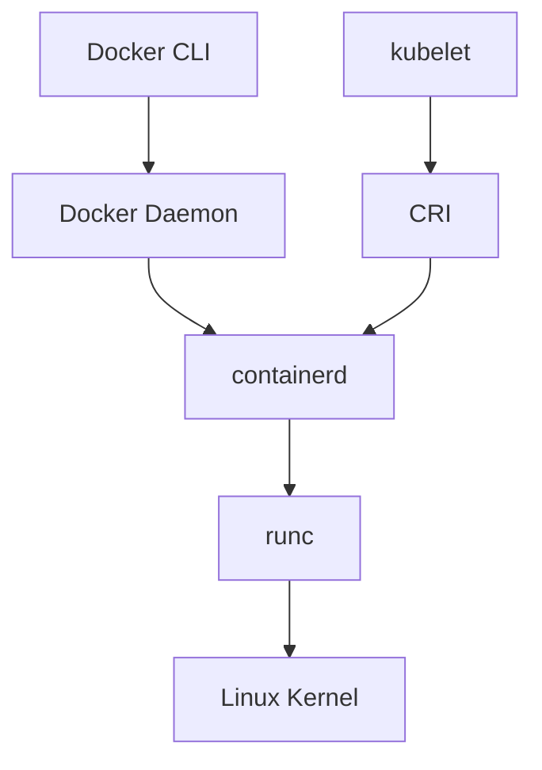

# CRI 与 Containerd

CRI（Container Runtime Interface）是 Kubernetes 定义的容器运行时接口。它让 kubelet 可以通过统一的 gRPC API 调用不同容器运行时，而不需要为 Docker、containerd、CRI-O、Kata Containers 等运行时分别维护适配逻辑。

containerd 是 Kubernetes 常用的容器运行时，负责镜像拉取、镜像存储、容器创建、生命周期管理、快照管理，并继续调用 runc 等 OCI Runtime 创建真正的 Linux 容器进程。

## 为什么需要 CRI

早期 Kubernetes 主要面向 Docker 使用，kubelet 内部维护了 dockershim 来适配 Docker Engine。随着运行时生态发展，如果每支持一种运行时都在 kubelet 中写适配代码，维护成本会越来越高。

CRI 解决了这个问题：

| 没有 CRI | 有 CRI |
| --- | --- |
| kubelet 需要直接适配不同运行时 | kubelet 只调用统一 CRI API |
| 运行时变更会影响 kubelet 代码 | 运行时自己实现 CRI |
| Docker 相关逻辑长期占用 Kubernetes 维护精力 | Kubernetes 与运行时解耦 |
| 新运行时接入门槛高 | 新运行时实现 CRI 即可接入 |

Kubernetes v1.24 起移除了内置 dockershim。这里说的是 Kubernetes 不再内置 Docker Engine 适配层，不是说 Kubernetes 不能运行 Docker 构建的镜像。只要镜像符合 OCI 镜像规范，containerd 和 CRI-O 等运行时仍然可以拉取并运行。

## 工作链路



创建一个 Pod 时，大致流程如下：

1. 用户提交 Deployment、Pod 等资源。
2. kube-scheduler 选出目标节点。
3. 目标节点上的 kubelet 监听到需要创建 Pod。
4. kubelet 通过 CRI 调用 containerd。
5. containerd 拉取镜像、创建 Pod sandbox、启动业务容器。
6. kubelet 继续通过 CRI 获取容器状态并上报给 apiserver。

## CRI、OCI、CNI 的区别

| 缩写 | 全称 | 解决的问题 |
| --- | --- | --- |
| CRI | Container Runtime Interface | kubelet 如何调用容器运行时 |
| OCI | Open Container Initiative | 镜像格式和底层运行时规范 |
| CNI | Container Network Interface | 容器网络如何创建和配置 |
| CSI | Container Storage Interface | 存储插件如何接入 Kubernetes |

不要把 CRI 和 OCI 混成一个概念。CRI 是 Kubernetes 面向运行时的接口；OCI 更底层，约束镜像格式和容器运行时行为；CNI 负责网络，常见实现有 Calico、Cilium、Flannel 等。

## Docker 与 containerd 的关系



Docker 是完整的容器平台，包含 Docker CLI、Docker Daemon、镜像构建、网络、卷、Compose 生态等能力。containerd 是更底层的运行时组件，专注容器生命周期和镜像管理。

在 Docker 场景中，用户通常通过 Docker Daemon 间接使用 containerd；在 Kubernetes 场景中，kubelet 可以通过 CRI 直接对接 containerd。

## containerd 负责什么

| 能力 | 说明 |
| --- | --- |
| 镜像管理 | 拉取、解压、存储、删除、打标签、推送镜像 |
| 容器生命周期 | 创建容器、启动 task、停止和删除 |
| 快照管理 | 管理镜像层和容器可写层 |
| 运行时调用 | 调用 runc 等 OCI Runtime 创建真正的容器进程 |
| CRI 接入 | 为 Kubernetes 提供 CRI 插件能力 |
| 命名空间隔离 | 用 containerd namespace 隔离不同上层系统的资源 |

containerd 不负责 Kubernetes API 对象调度，也不是 CNI 插件。Pod 调度由 Kubernetes 控制面完成，Pod 网络由 CNI 插件完成。

## 常见目录和文件

| 路径 | 说明 |
| --- | --- |
| `/etc/containerd/config.toml` | containerd 主配置文件 |
| `/run/containerd/containerd.sock` | containerd socket，kubelet/crictl 常连接这里 |
| `/var/lib/containerd` | 镜像、快照、元数据等持久数据 |
| `/etc/containerd/certs.d/` | registry hosts 配置目录，常用于私有仓库 |
| `/etc/crictl.yaml` | crictl 默认运行时端点配置 |

## 状态检查

查看节点运行时：

```bash
kubectl get nodes -o wide
kubectl describe node <node-name> | grep -i "Container Runtime"
```

查看 containerd：

```bash
containerd --version
ctr version
sudo systemctl status containerd
sudo journalctl -u containerd -n 100 --no-pager
```

查看 CRI：

```bash
sudo crictl info
sudo crictl version
```

如果 `crictl info` 无法连接，可以配置 `/etc/crictl.yaml`：

```bash
sudo tee /etc/crictl.yaml >/dev/null <<'EOF'
runtime-endpoint: unix:///run/containerd/containerd.sock
image-endpoint: unix:///run/containerd/containerd.sock
timeout: 10
debug: false
EOF
```

## 本节回顾

- CRI 是 kubelet 与容器运行时之间的标准接口。
- Kubernetes v1.24 起移除了内置 dockershim，但仍然可以运行 Docker 构建的 OCI 镜像。
- containerd 是运行时，不是完整 Docker 平台。
- Docker、Kubernetes 都可以使用 containerd，但入口和命名空间不同。

