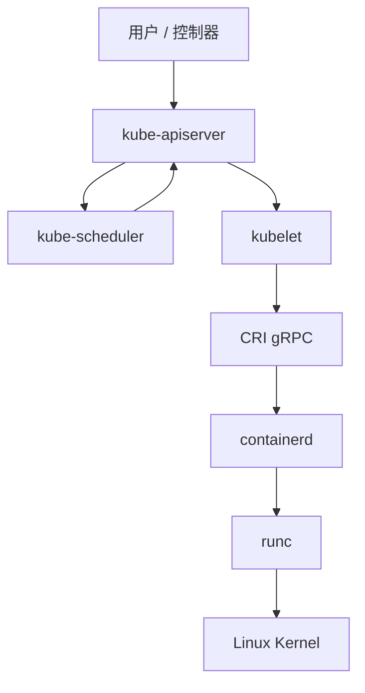
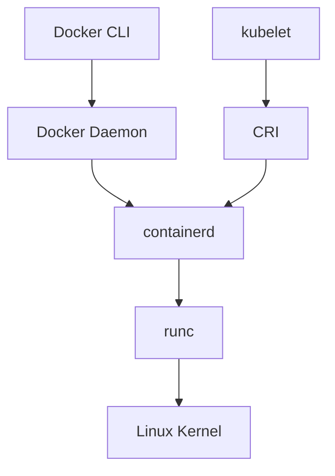

# CRI 与 Containerd

Kubernetes 不直接创建容器，而是通过 CRI 将 Pod 运行请求交给节点上的容器运行时。运行时负责镜像拉取、容器创建、进程启动和生命周期管理，containerd 是当前 Kubernetes 集群中常见的 CRI 运行时之一。

## CRI 是什么

CRI（Container Runtime Interface）是 kubelet 与容器运行时之间的 gRPC API 规范。kubelet 面向 CRI 发起请求，不需要关心底层实现是 containerd、CRI-O 还是其他符合接口规范的运行时。Kubernetes v1.26 起要求运行时提供 CRI v1 接口。

CRI 抽象出两类核心能力：

| 能力 | 说明 |
| --- | --- |
| RuntimeService | 管理 Pod sandbox、容器创建、启动、停止、删除和状态查询 |
| ImageService | 管理镜像拉取、镜像列表、镜像删除和镜像状态查询 |

通过 CRI，Kubernetes 可以保持 kubelet 逻辑稳定，由不同运行时项目自行实现接口适配。

## 为什么引入 CRI

早期 Kubernetes 主要面向 Docker Engine，kubelet 内部维护了 `dockershim` 来适配 Docker。随着容器运行时生态扩展，如果 kubelet 为每一种运行时都维护独立适配层，复杂度和维护成本会持续上升。

| 没有 CRI 的时代 | 引入 CRI 之后 |
| --- | --- |
| kubelet 为运行时维护适配逻辑 | kubelet 调用统一 CRI API |
| 运行时变更可能影响 kubelet 代码 | 运行时实现 CRI 即可接入 |
| Docker 相关逻辑占用 Kubernetes 维护精力 | Kubernetes 与运行时职责解耦 |
| 新运行时接入门槛较高 | 接入边界更清晰 |

Kubernetes v1.24 正式移除了内置 dockershim。移除的是 kubelet 中面向 Docker Engine 的适配层，不是 Docker 构建出来的镜像。镜像符合 OCI 规范即可被 containerd 和 CRI-O 拉取并运行。

containerd 自 v2.0 起引入了一些结构性变化：配置文件版本升级为 `version = 3`，CRI 插件 ID 从 `io.containerd.grpc.v1.cri` 变更为 `io.containerd.cri.v1.images` 和 `io.containerd.cri.v1.runtime`。Kubernetes 使用的 containerd 版本可能因发行版和集群版本而异。

## 工作链路



Pod 从提交到运行的基本流程如下：

1. 用户提交 Deployment 或 Pod，kube-apiserver 持久化资源对象。
2. kube-scheduler 为 Pod 绑定目标节点。
3. 目标节点上的 kubelet 监听到 Pod 变更，通过 CRI 请求 containerd 创建 Pod sandbox。
4. containerd 根据需要拉取镜像，准备快照层，创建 sandbox 和业务容器。
5. containerd 调用 runc 创建实际 Linux 容器进程。
6. kubelet 持续通过 CRI 获取容器状态，并上报给 kube-apiserver。

## CRI、OCI、CNI、CSI 的区别

这些标准经常同时出现，但解决的问题不同：

| 接口 | 全称 | 解决的问题 |
| --- | --- | --- |
| CRI | Container Runtime Interface | kubelet 如何调用容器运行时 |
| OCI | Open Container Initiative | 镜像格式和底层容器运行时行为规范 |
| CNI | Container Network Interface | 容器网络如何创建和配置 |
| CSI | Container Storage Interface | 存储插件如何接入 Kubernetes |

CRI 位于 kubelet 与运行时之间；OCI 更接近镜像格式、镜像分发和 runc 运行规范；CNI 负责 Pod 网络，例如 Calico、Cilium 等网络插件；CSI 负责存储插件接入。它们共同体现 Kubernetes 的可插拔架构，但职责边界不同。

## Docker 与 containerd 的关系



containerd 最初来自 Docker Engine 的内部组件，2016 年独立出来，2017 年捐赠给 CNCF，目前是 CNCF 毕业项目。

Docker 和 containerd 不是简单的替代关系。Docker 是面向开发者和运维人员的完整容器平台，包含 CLI、Daemon、构建、Compose、网络和卷等能力；containerd 更底层，聚焦镜像和容器生命周期管理。Docker 可以调用 containerd，Kubernetes 也可以通过 CRI 直接调用 containerd，但二者的入口、配置和存储视图并不相同。

## containerd 的核心职责

| 能力 | 说明 |
| --- | --- |
| 镜像管理 | 拉取、解包、存储、删除、打标签和推送镜像 |
| 容器生命周期 | 创建容器配置，启动、停止和删除容器进程 |
| 快照管理 | 管理镜像层和容器可写层，常见后端为 OverlayFS |
| OCI 运行时调用 | 调用 runc 等 OCI runtime 创建 Linux 容器进程 |
| CRI 插件 | 为 kubelet 提供 gRPC CRI 服务 |
| 命名空间隔离 | 使用 containerd namespace 隔离不同上层系统的运行时资源 |

containerd 不负责集群调度，也不负责 Pod 网络策略。调度由 kube-scheduler 完成，Pod 网络由 CNI 插件负责。

## 常用路径

| 路径 | 说明 |
| --- | --- |
| `/etc/containerd/config.toml` | containerd 主配置文件 |
| `/run/containerd/containerd.sock` | containerd gRPC socket |
| `/var/lib/containerd` | 镜像、快照和元数据持久化目录 |
| `/etc/containerd/certs.d/` | Registry hosts 配置目录 |
| `/etc/crictl.yaml` | crictl 端点配置文件 |

## 状态检查

从 Kubernetes 侧查看节点运行时版本：

```bash
kubectl get no -o wide
kubectl describe no <node-name> | grep -i "Container Runtime"
```

查看 containerd 自身状态：

```bash
containerd --version
sudo ctr version
sudo systemctl status containerd
sudo journalctl -u containerd -n 100 --no-pager
```

查看 CRI 接口状态：

```bash
sudo crictl info
sudo crictl version
```

如果 `crictl info` 无法连接运行时，需要检查 `/etc/crictl.yaml` 是否存在且 socket 路径正确。完整配置复用集群部署中的[安装并配置 crictl](../01-集群部署/2-运行时与组件安装.md#安装并配置-crictl)，此处不重复文件内容。
