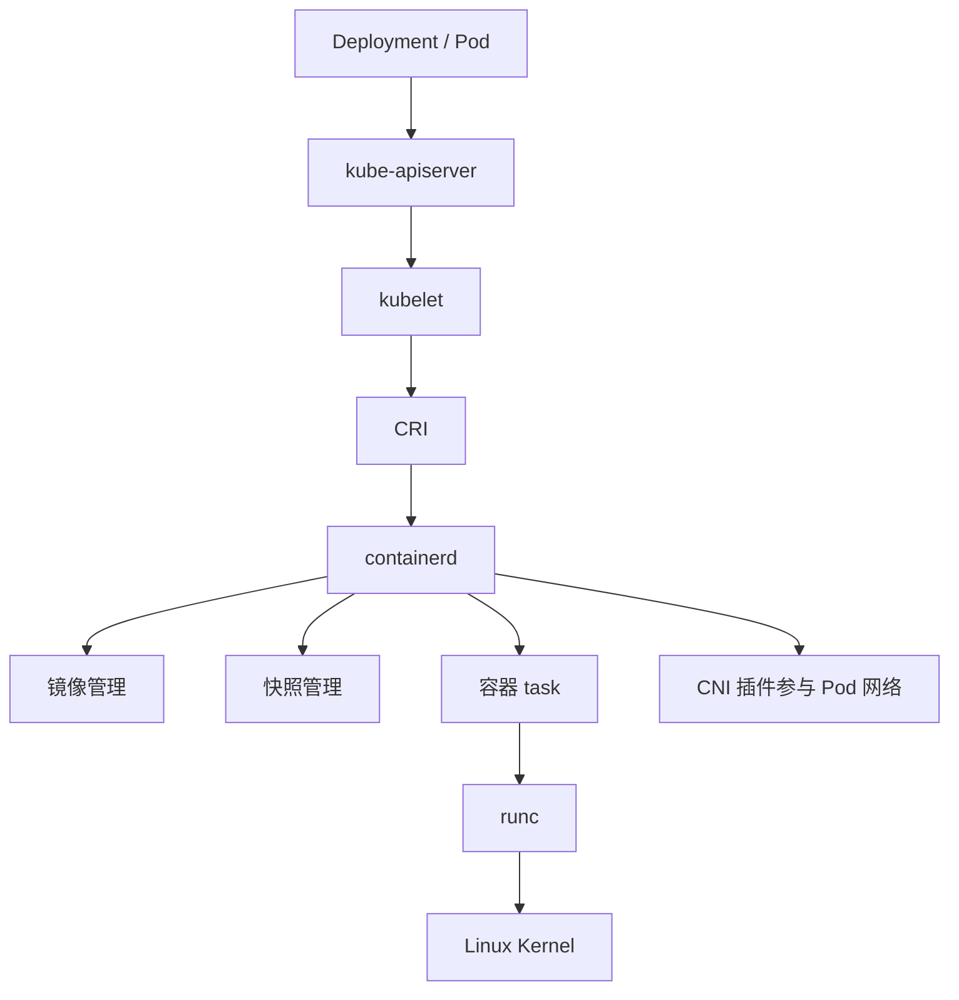

# 排障总结与面试

本节把 CRI、containerd、客户端工具、namespace 和私有仓库配置串起来，形成一个可复习、可排障、可面试表达的知识闭环。

## 核心链路



## 命令速查

| 目标 | 命令 |
| --- | --- |
| 查看节点运行时 | `kubectl describe node <node> \| grep -i "Container Runtime"` |
| 查看 CRI 信息 | `sudo crictl info` |
| 查看 Pod sandbox | `sudo crictl pods` |
| 查看容器 | `sudo crictl ps -a` |
| 查看 Kubernetes 镜像 | `sudo crictl images` |
| 用 ctr 查看 K8s 镜像 | `sudo ctr -n k8s.io images ls` |
| 查看 containerd namespace | `sudo ctr ns ls` |
| 查看 containerd 日志 | `sudo journalctl -u containerd -n 100 --no-pager` |
| 验证私有仓库拉取 | `sudo crictl pull <image>` |
| 查看 Pod 拉取失败原因 | `kubectl describe pod <pod> -n <namespace>` |

## 镜像拉取失败排障

1. 查看 Pod 事件：

```bash
kubectl describe pod <pod> -n <namespace>
```

2. 到目标节点验证：

```bash
sudo crictl pull <image>
```

3. 根据错误分类处理：

| 错误 | 处理 |
| --- | --- |
| `not found` | 检查仓库、项目、镜像名、tag |
| `unauthorized` | 检查账号权限和 `imagePullSecrets` |
| `x509` | 下发 CA 或修正证书 |
| `HTTP response to HTTPS client` | 配置 HTTP hosts.toml 或改用 HTTPS |
| `no such host` | 检查 DNS、hosts、网络 |

## 本地镜像不可见排障

检查：

```bash
sudo ctr images ls | grep <image>
sudo ctr -n k8s.io images ls | grep <image>
sudo crictl images | grep <image>
```

确认 YAML：

```yaml
imagePullPolicy: IfNotPresent
```

并确认 Pod 被调度到已经导入镜像的节点。多节点集群中，A 节点导入了镜像，不代表 B 节点也有。

## Docker 能拉，Kubernetes 不能拉

重点区别：

- Docker 使用 Docker Daemon 的配置。
- Kubernetes 节点使用 containerd 的 CRI 配置。
- Docker 镜像存储和 containerd 的 `k8s.io` namespace 不是同一套。

验证：

```bash
docker pull <image>
sudo crictl pull <image>
```

如果 Docker 成功但 `crictl` 失败，重点检查 containerd 的 registry 配置和节点证书信任。

## 常见面试问题

### Kubernetes 为什么移除 dockershim

Kubernetes 为了兼容 Docker Engine，曾在 kubelet 内维护 dockershim。随着 CRI 标准成熟，Kubernetes 可以通过统一接口对接 containerd、CRI-O 等运行时。继续维护内置 dockershim 会增加 kubelet 复杂度和维护成本，所以 Kubernetes v1.24 起移除了内置 dockershim。

### Kubernetes 不再内置 dockershim 后，还能用 Docker 制作镜像吗

可以。Docker 构建出来的镜像只要符合 OCI 镜像规范，就可以被 containerd、CRI-O 等运行时拉取和运行。变化的是节点运行时接入方式，不是镜像格式不能用了。

### Docker 和 containerd 是什么关系

Docker 是完整容器平台，包含 CLI、Daemon、构建、网络、卷等能力；containerd 是更底层的容器运行时，负责镜像和容器生命周期。Docker 可以调用 containerd，Kubernetes 也可以通过 CRI 直接调用 containerd。

### ctr、crictl、nerdctl 有什么区别

- `ctr`：containerd 原生低层工具，适合排查 containerd 本身。
- `crictl`：CRI 客户端，适合 Kubernetes 节点排查。
- `nerdctl`：接近 Docker CLI 体验，适合在 containerd 上做镜像和容器实验。

### imagePullSecrets 解决什么问题

`imagePullSecrets` 解决私有仓库认证问题，例如用户名、密码或机器人账号凭据。它不解决证书信任问题。如果节点不信任 Harbor 自签证书，即使 Secret 正确，也会拉取失败。

### containerd namespace 和 Kubernetes namespace 有什么区别

Kubernetes namespace 是集群 API 资源隔离，例如 `default`、`kube-system`。containerd namespace 是单节点运行时资源隔离，例如 `k8s.io`、`default`。两者名字可能相同，但完全不是一个层级。

## 生产建议

- 生产镜像仓库使用 HTTPS，优先使用可信证书或统一下发自签 CA。
- 不要长期依赖 `skip_verify` 或 HTTP 仓库。
- 节点运行时配置变更前先评估业务影响，必要时 drain 节点。
- 镜像发布应由 CI/CD 推送到仓库，不应依赖手工导入节点。
- 排障时优先通过 Kubernetes 对象和 CRI 观察，不要随意手工杀掉 kubelet 管理的容器。

## 本章回顾

- CRI 让 Kubernetes 与容器运行时解耦。
- containerd 是 Kubernetes 常用运行时，继续调用 runc 创建容器进程。
- `crictl` 是 Kubernetes 节点排查运行时问题的首选工具。
- `k8s.io` namespace 是理解 containerd 与 Kubernetes 关系的关键。
- 私有仓库问题要同时考虑协议、证书、认证、节点范围和镜像 tag。
