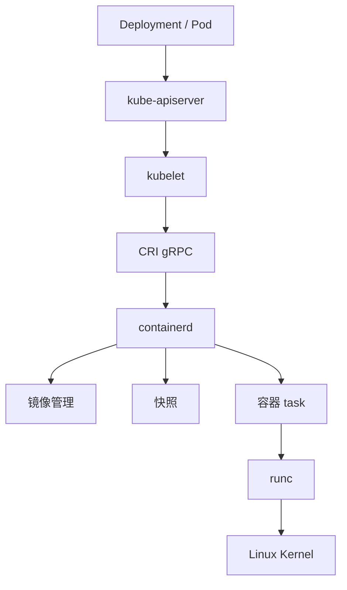

# 排障记录

本文将 CRI 理论、客户端工具、仓库配置和容器管理命令整理为排障链路、命令速查和问题记录，便于在节点运行时问题中快速定位故障边界。

## 核心链路



Pod 启动问题通常可以沿着 `Pod 事件 → kubelet → CRI → containerd → registry / runc` 的顺序排查。

## 命令速查

| 用途 | 命令 |
| --- | --- |
| 节点运行时版本 | `kubectl describe node <node> \| grep "Container Runtime"` |
| Pod 事件 | `kubectl describe pod <pod> -n <namespace>` |
| 集群事件排序 | `kubectl get events -A --sort-by=.lastTimestamp` |
| CRI 信息 | `sudo crictl info` |
| Pod sandbox | `sudo crictl pods` |
| 容器列表 | `sudo crictl ps -a` |
| Kubernetes 可见的镜像 | `sudo crictl images` |
| containerd 原生 Kubernetes 镜像 | `sudo ctr -n k8s.io images ls` |
| containerd namespace | `sudo ctr ns ls` |
| containerd 日志 | `sudo journalctl -u containerd -n 100 --no-pager` |
| 验证私有仓库拉取 | `sudo crictl pull <image>` |

## 镜像拉取失败排障

镜像拉取失败是节点运行时最常见的故障类型。推荐排查路径如下。

1. 查看 Pod 事件，确认失败节点和错误信息：

```bash
kubectl describe pod <pod> -n <namespace>
```

2. 登录失败节点，用 CRI 视角复现拉取：

```bash
sudo crictl pull <image>
```

3. 按错误信息分类处理：

| 错误 | 含义 | 修复方向 |
| --- | --- | --- |
| `not found` | 仓库、项目、镜像名或标签错误 | 检查镜像地址拼写，确认 Harbor 中存在对应镜像 |
| `unauthorized` / `authentication required` | 缺少认证或认证错误 | 检查 `imagePullSecrets`、Robot 账号和项目权限 |
| `x509` | 节点不信任仓库证书 | 分发 CA 证书或配置 `hosts.toml` 的 `ca` |
| `HTTP response to HTTPS client` | 协议不匹配 | 配置 HTTP `hosts.toml` |
| `no such host` | 域名无法解析 | 检查 DNS 或 `/etc/hosts` |
| `connection refused` | 服务端口不可达 | 检查 Harbor 服务、监听端口和节点防火墙 |
| `i/o timeout` | 网络链路超时 | 检查路由、防火墙、安全组和跨网段连通性 |
| `ImagePullBackOff` 但事件信息不足 | kubelet 事件不足以定位 | 查看 `journalctl -u containerd` 和 kubelet 日志 |

## Docker 能拉，Kubernetes 不能拉

该现象通常由三类差异引起：

1. 配置体系不同：Docker 使用 `/etc/docker/daemon.json`，containerd 使用 `/etc/containerd/config.toml` 和 `/etc/containerd/certs.d/`。
2. 存储路径不同：Docker 镜像存储与 Kubernetes 使用的 containerd 镜像存储并不等价。
3. 运行时视角不同：Kubernetes 通过 CRI 使用 containerd 的 `k8s.io` namespace。

验证命令：

```bash
docker pull <image>
sudo crictl pull <image>
```

Docker 成功但 `crictl` 失败时，应聚焦 containerd 的 registry 配置、证书信任和 Kubernetes 拉取凭据。

## ctr 能看到镜像，Pod 仍然拉不到

检查镜像所在 namespace：

```bash
sudo ctr images ls | grep nginx
sudo ctr -n k8s.io images ls | grep nginx
sudo crictl images | grep nginx
```

镜像必须出现在 `k8s.io` namespace 中，且 Pod 需要设置合适的 `imagePullPolicy`。离线导入镜像时，多节点集群中的每个候选节点都必须具备同一镜像。

## 生产建议

1. 镜像仓库优先使用 HTTPS 和权威 CA；内部 CA 场景应在所有节点统一分发证书。
2. 不应在生产环境长期使用 `skip_verify` 或 HTTP 仓库。
3. 变更节点运行时配置前，先评估业务影响；必要时通过 `kubectl drain` 迁移 Pod 后再操作。
4. 镜像发布应由 CI/CD 推送到 Harbor，不应依赖手工导入节点。
5. 排障时优先通过 `kubectl`、`crictl` 和日志观察，不应直接修改 kubelet 管理的容器和 task。
6. containerd、kubelet 和 CNI 变更应记录变更时间、影响节点和回滚方式。

## 常见问题记录

### Kubernetes 为什么移除 dockershim？

早期 kubelet 内置 dockershim 来适配 Docker Engine。随着 CRI 标准成熟，containerd、CRI-O 等运行时通过实现 CRI 即可接入 Kubernetes，不再需要 kubelet 为每种运行时维护独立适配代码。Kubernetes v1.24 移除 dockershim，是为了降低 kubelet 复杂度，并将运行时适配责任交给运行时项目本身。

### 移除 dockershim 后还能使用 Docker 构建的镜像吗？

可以。Docker 构建的镜像符合 OCI 镜像规范，containerd 和 CRI-O 都可以拉取并运行。变化的是节点上负责运行容器的组件，不是镜像格式。

### Docker 和 containerd 是什么关系？

containerd 最初是 Docker Engine 的内部组件，后来独立成为 CNCF 项目。Docker 是完整的容器平台，包含 CLI、Daemon、构建和 Compose 等能力；containerd 聚焦镜像和容器生命周期。Kubernetes 通过 CRI 直接对接 containerd，不需要经过 Docker Daemon。

### ctr、crictl、nerdctl 如何选择？

- `crictl`：排查 Kubernetes 节点首选，走 CRI 接口，视角接近 kubelet
- `ctr`：containerd 原生低层工具，适合验证 containerd 本身和 namespace 问题
- `nerdctl`：提供 Docker 风格体验，适合在 containerd 上进行本地实验

### imagePullSecrets 和 hosts.toml 分别解决什么问题？

- `hosts.toml` 解决连接方式，包括 HTTP/HTTPS、证书信任和仓库访问能力
- `imagePullSecrets` 解决身份认证，包括用户名、密码或 Token

二者独立工作。证书配置错误时，即使 Secret 正确也会报 `x509`；Secret 错误时，即使证书配置正确也会报 `unauthorized`。

### containerd namespace 和 Kubernetes namespace 是一回事吗？

不是。Kubernetes namespace 是集群 API 层面的资源隔离，用于隔离 Pod、Service 等对象；containerd namespace 是单节点运行时层面的资源隔离，用于隔离镜像、容器和快照。`kubectl get pods -n default` 和 `ctr -n default images ls` 中的 `default` 没有关联。Kubernetes 通常使用 containerd 的 `k8s.io` namespace。
