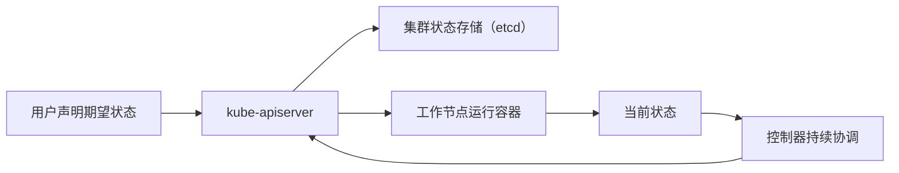
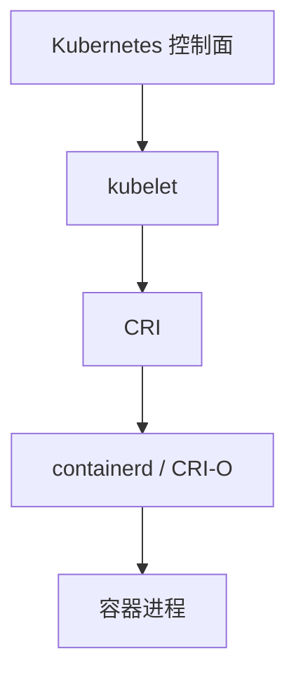

# Kubernetes 基本概念

Kubernetes（K8s）是面向容器化应用的集群编排系统，负责在成百上千台机器上自动完成部署、扩缩、故障恢复、服务发现和运行状态管理。

在单机环境中，使用 Docker 或 containerd 运行容器相对简单。生产环境中的服务通常分布在多台机器上，还需要面对节点故障、流量分发、配置差异、版本切换和资源争用等问题，这些场景需要集群级平台进行统一协调。

## 声明式模型

Kubernetes 不是逐步执行操作命令的工具，而是面向期望状态进行持续协调的平台。用户提交期望状态后，Kubernetes 会持续推动当前状态接近期望状态。

例如声明某个服务需要 3 个副本，Kubernetes 会尽量确保集群中始终存在 3 个可用 Pod。Pod 异常退出或节点故障时，控制器会自动补建副本，用户不需要额外编写恢复脚本。

## 来源与定位

Kubernetes 的设计灵感来自 Google 内部的 Borg 系统。Borg 十余年在 Google 大规模生产环境中调度、管理和运行在线与离线任务，Kubernetes 吸收了这些经验并重新开源实现，成为 CNCF 的第一个毕业项目。

它解决的问题不是如何创建单个容器，而是如何在一组机器上长期、稳定、安全地运行大量容器化应用。因此它关注的范围不只包括容器本身，还包括调度、网络、存储、权限、安全、可观测性和扩展机制。

## 平台能力一览

Kubernetes 屏蔽了底层机器差异，应用通过统一的资源对象描述部署到集群：

| 能力 | 通过哪些资源实现 |
| --- | --- |
| 应用部署 | Deployment、StatefulSet、DaemonSet 等管理副本和运行策略 |
| 弹性伸缩 | 副本数调整和基于指标的 HPA |
| 服务发现 | Service 为一组 Pod 提供稳定的集群内访问入口 |
| 负载均衡 | Service、kube-proxy 或 IPVS 将请求分发到后端 Pod |
| 自愈恢复 | 容器/Pod/节点异常时自动重建或迁移 |
| 配置管理 | ConfigMap、Secret 将配置和敏感数据从镜像中拆分 |
| 存储编排 | PV、PVC、StorageClass 和 CSI 对接各类存储系统 |
| 资源隔离 | Namespace、RBAC、ResourceQuota、LimitRange 划分团队边界 |

## 与容器运行时的关系

Kubernetes 不直接创建 Linux 容器进程。kubelet 通过 CRI 把 Pod 的创建请求交给容器运行时（containerd、CRI-O），运行时再拉取镜像、创建容器和管理进程。

需要明确这条边界：容器运行时负责单节点的容器生命周期，Kubernetes 负责集群范围内应用的调度、发布、恢复和治理。

## 学习主线

后续章节中的 kubectl、Pod、Deployment、Service、ConfigMap 和 Namespace，本质上都围绕三条主线展开：

- 应用视角：代码、镜像、Pod、调度资源与服务发布。
- 平台视角：资源声明、APIServer 持久化、控制器协调与节点执行。
- 节点视角：kubelet 接收 Pod、CRI 调用运行时与容器进程运行。
