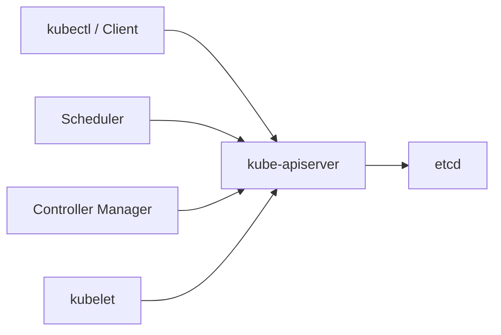

# 控制节点组件

控制节点维护集群的全局状态：接收用户请求、持久化资源对象、执行调度决策、持续协调实际状态与期望状态。

## kube-apiserver

APIServer 是集群统一的资源操作入口。kubectl、Scheduler、Controller Manager、kubelet 等组件都通过它读写资源。



APIServer 的主要职责包括：

- 提供 REST API，处理认证、授权和准入控制。
- 校验资源格式和字段合法性。
- 将资源对象持久化到 etcd。
- 为其他组件提供 watch 机制，推送资源变更事件。

APIServer 是无状态组件，可以横向扩展。它是唯一直接访问 etcd 的核心组件，其他组件不会绕过它读写集群数据。

## etcd

etcd 是一个分布式 KV 存储，保存集群中所有资源对象和关键状态。Pod、Deployment、Service、ConfigMap、Node 等最终都持久化在这里。

生产要点：

- 部署奇数节点（3 或 5），保证多数派容灾。
- 使用 SSD，降低写入延迟。
- 定期备份快照，这是集群恢复的底线。
- 保护证书和备份文件，防止数据泄露。

一旦 etcd 数据丢失且无备份，集群中的资源对象将无法恢复。其他组件可以重建，etcd 中保存的数据则不可再生。

## kube-scheduler

Scheduler 负责为未调度的 Pod 选择运行节点。调度分为两步：

| 阶段 | 说明 |
| --- | --- |
| 过滤 | 排除不满足条件的节点：资源不足、标签不匹配、污点不可容忍 |
| 打分 | 对剩余节点按策略评分，选择最优节点 |

选中节点后，Scheduler 通过 APIServer 将 Pod 绑定到该节点。目标节点上的 kubelet 监听到 Pod 被分配给本节点后，开始创建容器。

## kube-controller-manager

Controller Manager 是多个控制器的集合。每个控制器负责一类资源的协调。它们不直接运行 Pod，而是通过 APIServer 读写资源来驱动状态变化。

核心控制器：

| 控制器 | 职责 |
| --- | --- |
| Deployment Controller | 管理 Deployment 与 ReplicaSet 的关系 |
| ReplicaSet Controller | 保证 Pod 副本数达到期望值 |
| Node Controller | 监控节点状态，处理节点失联 |
| Job Controller | 管理一次性任务的执行和完成 |
| EndpointSlice Controller | 维护 Service 的后端端点信息 |

控制器的核心逻辑是“持续协调”。例如期望副本数为 3，实际只有 2 个时会创建 1 个；实际出现 4 个时会删除 1 个。控制器不是一次性命令，而是在循环中不断纠正状态偏差。

## 高可用

在多控制节点环境中：

| 组件 | 高可用方式 |
| --- | --- |
| APIServer | 多副本 + 负载均衡器 |
| etcd | Raft 协议，奇数节点集群 |
| Scheduler | 多副本，Leader 选举，同一时刻只有一个实例工作 |
| Controller Manager | 多副本，Leader 选举，同一时刻只有一个实例工作 |

Leader 选举信息保存在 `kube-system` 命名空间的 Lease 资源中：

```bash
kubectl get leases -n kube-system
```

## Deployment 控制面链路

1. `kubectl create deployment` 请求进入 APIServer，完成认证、校验并写入 etcd。
2. Deployment Controller 发现新的 Deployment，创建 ReplicaSet。
3. ReplicaSet Controller 发现期望副本数不足，创建 Pod 对象。
4. Scheduler 发现未绑定节点的 Pod，经过过滤和打分后绑定到目标节点。
5. 目标节点 kubelet 发现分配给本节点的 Pod，调用 Runtime 创建容器。

整个过程用户只执行了一条声明命令，后续由控制面自动协调完成。
