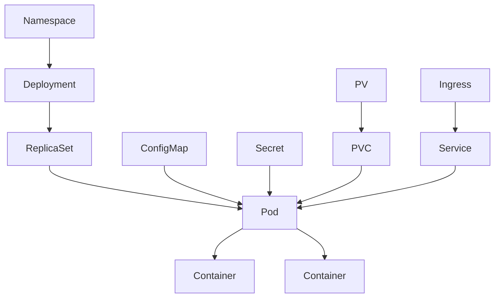
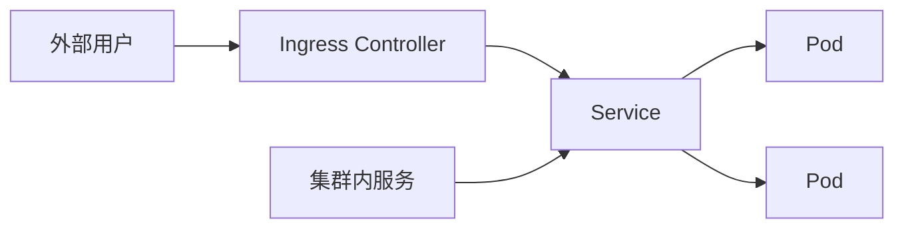

# 核心资源与抽象

Kubernetes 概念较多，这是初学阶段的直观感受。每一个概念都不是凭空设计的，它们将应用运行中的不同问题拆分为不同资源对象，每个对象负责解决一类具体问题。

## 按用途分类

| 分类 | 资源 | 解决的问题 |
| --- | --- | --- |
| 运行单元 | Pod、Container | 承载和运行应用进程 |
| 调度管理 | Deployment、StatefulSet、DaemonSet、ReplicaSet | 管理副本数、发布策略、运行形态 |
| 任务 | Job、CronJob | 一次性或周期性任务 |
| 服务发现 | Service、EndpointSlice、Ingress | 为动态 Pod 提供稳定访问入口 |
| 配置 | ConfigMap、Secret | 把配置从镜像中拆分出来 |
| 存储 | PV、PVC、StorageClass | 管理持久化数据与动态供给 |
| 隔离 | Namespace、ResourceQuota、LimitRange、RBAC | 划分资源边界、控制使用上限 |

部署一个完整服务通常会同时用到 Deployment、Pod、Service、ConfigMap、Secret 和 Ingress。这不是过度设计，而是每个对象各司其职。

## 资源关系



Pod 是运行容器的原子单元，但在生产实践中很少直接使用裸 Pod。Deployment 管理副本和更新策略；Service 和 Ingress 提供访问入口；ConfigMap、Secret、PVC 注入运行时依赖。

## 调度资源选择

| 资源 | 适合 |
| --- | --- |
| Deployment | 无状态 Web 服务（Java、Go、PHP、Node.js） |
| StatefulSet | 有状态服务（MySQL、Kafka、ZooKeeper、Eureka） |
| DaemonSet | 每节点一个副本（日志采集、监控 Agent、网络组件） |
| Job | 一次性任务（数据迁移、初始化） |
| CronJob | 定时任务（备份、清理、报表） |

Deployment 关注副本数和平滑更新；StatefulSet 关注稳定网络标识和存储持久化；DaemonSet 关注节点覆盖；Job/CronJob 关注任务完成状态。

## 服务发布

Pod IP 随重建变化，调用方不应直接依赖它。Service 为一组带相同标签的 Pod 提供一个稳定的虚拟 IP 和 DNS 名称：



外部流量通常经过 Ingress、Service 再进入 Pod；内部流量通常通过 Service 名称访问 Pod。Pod 重建后 IP 会发生变化，Service 会自动感知并更新后端。

## 配置分离

不同环境需要不同配置。如果配置写入镜像，就需要为 dev、test、prod 分别构建镜像，这违背了“一次构建、到处运行”的原则。

ConfigMap 存普通配置，Secret 存敏感数据（密码、Token、证书）。它们通过环境变量或文件挂载注入 Pod，镜像保持统一。

## 资源隔离

Namespace 是最常用的逻辑隔离手段：

```text
dev     → 开发环境
test    → 测试环境
prod    → 生产环境
team-a  → A 团队资源
team-b  → B 团队资源
```

Namespace 本身只负责逻辑分组，完整隔离还需要配合 RBAC、ResourceQuota、LimitRange 和 NetworkPolicy，分别控制权限、资源上限、单个 Pod 限制和网络访问边界。

## 为什么需要这么多抽象

每一个抽象对应一个真实的生产问题：

| 现实问题 | K8s 抽象 |
| --- | --- |
| 应用运行 | Pod |
| 副本管理 | Deployment、StatefulSet、DaemonSet |
| 服务发现 | Service |
| 外部流量接入 | Ingress |
| 配置与镜像分离 | ConfigMap、Secret |
| 数据持久化 | PV、PVC、StorageClass |
| 团队隔离 | Namespace、RBAC、Quota |
| 任务执行 | Job、CronJob |

学习 Kubernetes 不必一次记住所有字段，而应先理解每个资源解决的问题。后续章节会围绕这些资源逐一展开实操。
