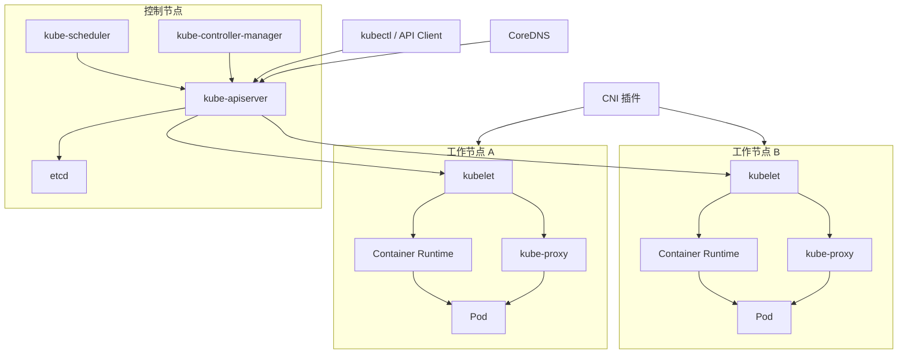

# Kubernetes 架构全景

Kubernetes 集群由控制节点、工作节点和插件体系三层组成。控制节点负责决策和状态管理，工作节点负责运行 Pod，插件体系负责补齐网络、DNS、监控等具体能力。

## 整体架构

用户通过 kubectl 访问 APIServer，不直接操作节点上的容器。控制面组件围绕 APIServer 读写资源状态，节点上的 kubelet 根据分配到本节点的 Pod 描述启动容器。

## 用户入口：kubectl

kubectl 是最常用管理工具。只要有 kubeconfig 和网络连通，就可以在任意位置操作集群：

- 创建、查看、更新、删除 Kubernetes 资源。
- 查看 Pod、Node、Deployment、Service 等对象状态。
- 进入容器执行命令或查看日志。
- 查询资源字段说明（`kubectl explain`），辅助编写 YAML。
- 触发滚动更新、回滚、扩缩容等操作。

kubectl 本质上是 APIServer 的 HTTP 客户端，不会绕过控制面直接修改节点状态。

## 控制节点

控制节点（Control Plane）是集群的大脑，通常不承载业务 Pod，主要负责状态管理和决策：

| 组件 | 职责 |
| --- | --- |
| kube-apiserver | REST API 入口，认证授权，资源校验，状态读写 |
| etcd | 分布式 KV 存储，保存集群全部关键数据 |
| kube-scheduler | 为未调度的 Pod 选择最优节点 |
| kube-controller-manager | 运行多种控制器，持续协调资源状态 |

生产环境通常部署 3 个或更多控制节点，APIServer 通过负载均衡器暴露高可用入口，避免单点故障。

## 工作节点

工作节点是执行层，负责运行业务 Pod：

| 组件 | 职责 |
| --- | --- |
| kubelet | 接收 Pod 任务、调用运行时、创建容器并上报状态 |
| Container Runtime | 拉取镜像、创建容器、管理进程生命周期 |
| kube-proxy | 维护 Service 转发规则（iptables、ipvs 或 nftables） |
| CNI 插件 | 为 Pod 分配 IP、配置网络、实现跨节点通信 |

Pod 最终运行在哪个节点由 Scheduler 决策；Pod 创建、启动和监控由对应节点的 kubelet 执行。

## 插件体系

Kubernetes 核心是编排框架，很多具体能力由可替换的插件提供：

| 插件 | 作用 | 常见选择 |
| --- | --- | --- |
| DNS | 集群内服务和域名解析 | CoreDNS |
| CNI | Pod 网络 | Calico、Cilium、Flannel |
| Metrics | 资源指标采集 | Metrics Server |
| CSI | 存储对接 | 云盘、NFS、CubeFS 等驱动 |
| Ingress | 南北向流量接入 | Nginx Ingress、Istio Gateway |

这种“核心精干、插件扩展”的架构，使 Kubernetes 可以适配不同基础设施环境。

## 排障视角

理解架构后，排查问题时可以沿着以下链路定位：

1. 资源是否提交成功，链路为 kubectl、APIServer、etcd。
2. 调度是否完成，即 Scheduler 是否将 Pod 绑定到 Node。
3. 节点是否接收任务，即 kubelet 是否通过 CRI 调用 Runtime。
4. 容器是否创建，即 Runtime 是否调用 runc 创建进程。
5. 网络和存储是否正常接入，重点检查 CNI 和 CSI。
