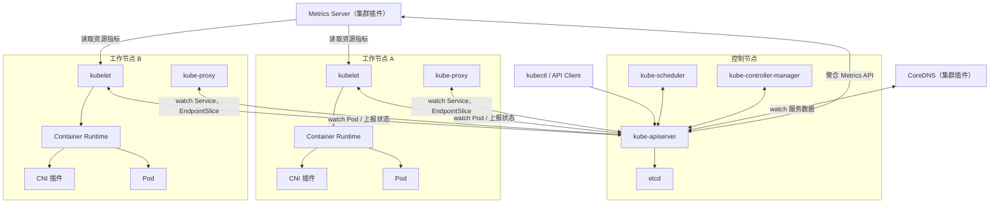

# Kubernetes 架构全景

Kubernetes 集群由控制面和节点执行层构成；DNS、网络、存储、指标等能力通常由集群插件或扩展实现。控制面负责状态管理和决策，工作节点负责运行 Pod，插件通过 Kubernetes API 或节点运行时接入相应能力。

## 整体架构

用户通过 kubectl 访问 APIServer，不直接操作节点上的容器。控制面组件围绕 APIServer 读写资源状态；kubelet 主动 watch 分配到本节点的 Pod 并上报状态，容器运行时在创建 Pod sandbox 时调用配置好的 CNI 插件。

## 用户入口：kubectl

kubectl 是最常用管理工具。只要有 kubeconfig 和网络连通，就可以在任意位置操作集群：

- 创建、查看、更新、删除 Kubernetes 资源。
- 查看 Pod、Node、Deployment、Service 等对象状态。
- 进入容器执行命令或查看日志。
- 查询资源字段说明（`kubectl explain`），辅助编写 YAML。
- 触发滚动更新、回滚、扩缩容等操作。

kubectl 本质上是 APIServer 的 HTTP 客户端，不会绕过控制面直接修改节点状态。

## 控制节点

控制平面（Control Plane）是集群的大脑，负责状态管理和决策；其组件通常集中部署在专用的控制节点上。许多生产集群会通过污点避免业务 Pod 调度到这些节点，但这不是 Kubernetes 的强制要求：移除相应污点后，控制节点也可以承载工作负载。

| 组件 | 职责 |
| --- | --- |
| kube-apiserver | REST API 入口，认证授权，资源校验，状态读写 |
| etcd | 分布式 KV 存储，保存集群全部关键数据 |
| kube-scheduler | 为未调度的 Pod 选择最优节点 |
| kube-controller-manager | 运行多种控制器，持续协调资源状态 |

集群需要接入外部云提供商 API 时，还可以部署可选的 cloud-controller-manager，承载节点生命周期、云负载均衡器和路由等控制逻辑。是否部署取决于是否启用了这类云集成，而不是集群的安装方式。

生产环境通常部署 3 个或更多控制节点，APIServer 通过负载均衡器暴露高可用入口，避免单点故障。

## 工作节点

工作节点是执行层，负责运行业务 Pod：

| 组件 | 职责 |
| --- | --- |
| kubelet | 接收 Pod 任务、调用运行时、创建容器并上报状态 |
| Container Runtime | 拉取镜像、创建容器、管理进程生命周期 |
| kube-proxy | 通常以每节点一个实例维护 Service 转发规则（iptables、nftables 或已弃用的 ipvs） |
| CNI 插件 | 由容器运行时调用，为 Pod sandbox 配置网络；跨节点通信和网络策略能力取决于具体实现 |

Pod 最终运行在哪个节点由 Scheduler 决策；Pod 创建、启动和监控由对应节点的 kubelet 执行。

## 插件体系

Kubernetes 核心是编排框架，很多具体能力由可替换的插件提供：

| 插件 | 作用 | 常见选择 |
| --- | --- | --- |
| DNS | 集群内服务和域名解析 | CoreDNS |
| CNI | Pod 网络；是否支持网络策略取决于实现 | Calico、Cilium、Flannel |
| Metrics | 资源指标 API 与短期资源指标采集 | Metrics Server |
| CSI | 存储对接 | 云盘、NFS、CubeFS 等驱动 |
| Ingress Controller | Kubernetes Ingress 规则落地 | Traefik、HAProxy Ingress、Contour |
| Gateway API 实现 | GatewayClass、Gateway、HTTPRoute 等资源落地 | Istio、Envoy Gateway、Kong |

> [!NOTE]
> 曾经最流行的 ingress-nginx 已于 2026 年 3 月退役，仓库归档后不再提供缺陷修复和安全更新。Kubernetes 官方建议迁移到 Gateway API 实现或其他仍在维护的 Ingress Controller。

这种“核心精干、插件扩展”的架构，使 Kubernetes 可以适配不同基础设施环境。

## 常见集群插件

CoreDNS 是常用的集群 DNS 插件。在 kubeadm 集群中，它通常以 Deployment 运行在 `kube-system` 命名空间，并通过名为 `kube-dns` 的 Service 暴露解析入口。普通 Service 名称通常解析为 ClusterIP；带 selector 的 Headless Service 则会返回后端就绪 Pod 的地址记录。`cluster.local` 是常见的默认集群域名后缀，实际值可由集群 DNS 配置调整。

Metrics Server 从 kubelet 采集短期 CPU、内存资源指标，并通过 `metrics.k8s.io` API 提供给 `kubectl top` 和使用资源指标的 HPA。它是资源指标管道的参考实现，不随 kubeadm 默认部署，也不替代 Prometheus 等长期监控方案。

## 排障视角

理解架构后，排查问题时可以沿着以下链路定位：

1. 资源是否提交成功，链路为 kubectl、APIServer、etcd。
2. 调度是否完成，即 Scheduler 是否将 Pod 绑定到 Node。
3. 节点是否接收任务，即 kubelet 是否通过 CRI 调用容器运行时。
4. Pod sandbox、镜像和业务容器是否创建成功；运行时会在 sandbox 生命周期中调用 CNI 配置网络。
5. Service 转发、DNS、网络和存储是否正常接入，重点检查 kube-proxy 或替代实现、CoreDNS、CNI 和 CSI。

## 参考

- [Kubernetes 组件](https://kubernetes.io/docs/concepts/overview/components/)
- [控制器模式](https://kubernetes.io/docs/concepts/architecture/controller/)
