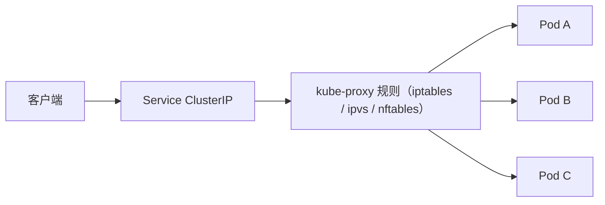

# 工作节点组件

控制面负责决策，工作节点负责执行。每个节点上的 kubelet、容器运行时、kube-proxy 和 CNI 插件共同完成 Pod 运行、状态上报和服务转发。CoreDNS 和 Metrics Server 不属于节点组件，而是以 Deployment 形式运行在集群中的插件，因与节点链路关系紧密，也在本文一并记录。

## kubelet

kubelet 是节点上的核心代理，是控制面与容器运行时之间的桥梁：

- 向 APIServer 注册节点，定时上报 Node 状态（心跳、资源、运行容器）。
- 监听分配给本节点的 Pod（通过 APIServer watch）。
- 通过 CRI 调用运行时创建 Pod sandbox 和业务容器。
- 执行 liveness、readiness 和 startup 探针。
- 管理挂载卷、Secret、ConfigMap 等 Pod 依赖。

kubelet 异常会导致节点变为 NotReady，控制面无法获取该节点上 Pod 的准确信息，调度器也不会再向该节点分配新 Pod。

## Container Runtime

运行时通过 CRI 与 kubelet 交互，负责具体的容器操作：

- 拉取和管理容器镜像。
- 创建 Pod sandbox。
- 创建、启动、停止、删除容器。
- 管理容器进程、日志和退出码。
- 调用 runc 等 OCI runtime 创建底层 Linux 容器。

常见运行时包括 containerd 和 CRI-O。本文档环境使用 containerd。kubelet 不依赖具体实现，只要运行时符合 CRI 规范即可。

## kube-proxy

kube-proxy 维护节点上的转发规则，将 Service 的虚拟 IP 请求转发到后端 Pod：



它监听 Service 和 EndpointSlice 的变化，动态更新转发规则。Linux 节点上支持 iptables（默认）、nftables 和 ipvs 三种代理模式，ipvs 自 v1.35 起已弃用。部分现代 CNI（如 Cilium）自带 Service 转发实现，此时节点可以不运行 kube-proxy。

## CNI 网络插件

CNI 负责 Pod 的网络配置。kubelet 创建 Pod 时调用 CNI 插件，完成：

- Pod IP 分配。
- 网络接口创建和路由配置。
- 跨节点 Pod 通信（路由、VXLAN 或 eBPF）。
- 网络策略控制。

常见选择包括 Calico、Cilium 和 Flannel。本文档环境使用 Calico。网络插件异常时，Pod 可能创建失败、获取错误 IP，或无法跨节点通信。

## CoreDNS

CoreDNS 是集群默认的 DNS 插件，在 kubeadm 集群中以 Deployment 运行在 `kube-system` 命名空间，通过名为 `kube-dns` 的 Service 暴露解析入口。应用通过名称访问服务，而不是硬编码 Pod IP：

```text
redis                             # 同一命名空间内直接使用 Service 名称
redis.default                     # 跨命名空间使用 <service>.<namespace>
redis.default.svc.cluster.local   # 完整域名（FQDN）
```

Pod IP 随重建变化，Service 名称是稳定的。CoreDNS 将普通 Service 名称解析为 ClusterIP；对于 Headless Service，则直接返回后端各 Pod 的 IP 记录。`cluster.local` 是常见默认集群域名后缀，可通过 kubelet 或 kubeadm 的集群 DNS 配置调整。应用之间应通过名称调用，而不是硬编码 Pod IP。

## Metrics Server

Metrics Server 从各节点 kubelet 采集短期 CPU、内存资源指标，通过 `metrics.k8s.io` API 供 `kubectl top` 和 HPA 使用。它不随 kubeadm 默认部署，本环境在第 01 章单独安装：

```bash
kubectl top nodes
kubectl top pods
```

它提供的是资源指标管道，不适合作为完整的长期监控系统。长期监控通常需要使用 Prometheus 等方案。

## 节点执行链路

一个 Pod 被调度到节点后的完整过程：

1. kubelet 从 APIServer watch 到 Pod 绑定到本节点。
2. kubelet 准备 Secret、ConfigMap、PVC 等挂载依赖。
3. kubelet 通过 CRI 调用容器运行时。
4. 运行时在本地无镜像时拉取镜像，并创建 Pod sandbox。
5. CNI 插件为 sandbox 配置网络，包括 IP 分配和路由配置。
6. 运行时在 sandbox 内创建并启动业务容器。
7. kubelet 持续执行探针检查并上报状态。

排障时可以按此顺序逐项检查：调度是否完成、kubelet 是否感知 Pod、镜像是否拉取成功、sandbox 是否创建成功、CNI 是否分配 IP、容器是否启动、探针是否通过。
