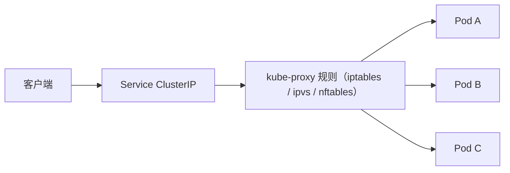

# 工作节点组件

控制面负责决策，工作节点负责执行。节点上的 kubelet、容器运行时、kube-proxy 和 CNI 插件共同完成 Pod 运行、状态上报和 Service 转发。CoreDNS、Metrics Server 等集群插件的职责见[第 3 篇](./3-Kubernetes架构全景.md#常见集群插件)。

## kubelet

kubelet 是节点上的核心代理，是控制面与容器运行时之间的桥梁：

- 向 APIServer 注册节点，定时上报 Node 状态（心跳、资源、运行容器）。
- 监听分配给本节点的 Pod（通过 APIServer watch）。
- 通过 CRI 调用运行时创建 Pod sandbox 和业务容器。
- 执行 liveness、readiness 和 startup 探针。
- 管理挂载卷、Secret、ConfigMap 等 Pod 依赖。

kubelet 停止上报状态后，Node Controller 会在超时后将节点标记为 `Unknown` 或 `NotReady` 并添加相应污点。默认情况下，调度器不会继续向该节点分配新 Pod；已运行 Pod 的后续处理则受污点容忍、工作负载控制器和节点故障处理策略影响。

## Container Runtime

运行时通过 CRI 与 kubelet 交互，负责具体的容器操作：

- 拉取和管理容器镜像。
- 创建 Pod sandbox。
- 创建、启动、停止、删除容器。
- 管理容器进程、日志和退出码。
- 调用 runc 等 OCI runtime 创建底层 Linux 容器。
- 在 Pod sandbox 生命周期中调用已配置的 CNI 插件完成网络设置。

常见运行时包括 containerd 和 CRI-O。本文档环境使用 containerd。kubelet 不依赖具体实现，只要运行时符合 CRI 规范即可。

## kube-proxy

kube-proxy 维护节点上的转发规则，将 Service 的虚拟 IP 请求转发到后端 Pod：

它监听 Service 和 EndpointSlice 的变化，动态更新转发规则。Linux 节点上支持 iptables（默认）、nftables 和 ipvs 三种代理模式，ipvs 自 v1.35 起已弃用。部分 CNI（如启用 eBPF Service 实现的 Cilium）可以替代 kube-proxy；只有在该能力已明确启用并验证后，节点才不再运行 kube-proxy。

## CNI 网络插件

CNI 插件负责 Pod sandbox 的网络配置。kubelet 通过 CRI 请求容器运行时创建 sandbox，运行时再调用已配置的 CNI 插件。具体 CNI 实现通常能够完成以下部分或全部工作：

- Pod IP 分配。
- 网络接口创建和路由配置。
- 跨节点 Pod 通信（路由、VXLAN 或 eBPF）。
- 网络策略控制（仅限实现该能力的插件）。

常见选择包括 Calico、Cilium 和 Flannel。本文档环境使用 Calico。网络插件异常时，Pod 可能创建失败、获取错误 IP，或无法跨节点通信；NetworkPolicy 是否生效还需要确认所选插件支持并已启用该能力。

## 节点执行链路

一个 Pod 被调度到节点后的完整过程：

1. kubelet 从 APIServer watch 到 Pod 绑定到本节点。
2. kubelet 准备 Secret、ConfigMap 和卷挂载等 Pod 依赖。
3. kubelet 按 `imagePullPolicy` 通过 CRI 请求运行时复用本地镜像或拉取缺失镜像，并创建 Pod sandbox。
4. 运行时调用 CNI 插件为 sandbox 配置网络，包括 IP 分配和路由配置。
5. 运行时在 sandbox 内创建并启动业务容器。
6. kubelet 持续执行探针检查并上报状态。

排障时可以按此顺序逐项检查：调度是否完成、kubelet 是否感知 Pod、镜像是否拉取成功、sandbox 是否创建成功、CNI 是否分配 IP、容器是否启动、探针是否通过。

## 参考

- [Kubernetes 组件](https://kubernetes.io/docs/concepts/overview/components/)
- [容器运行时接口](https://kubernetes.io/docs/concepts/architecture/cri/)
