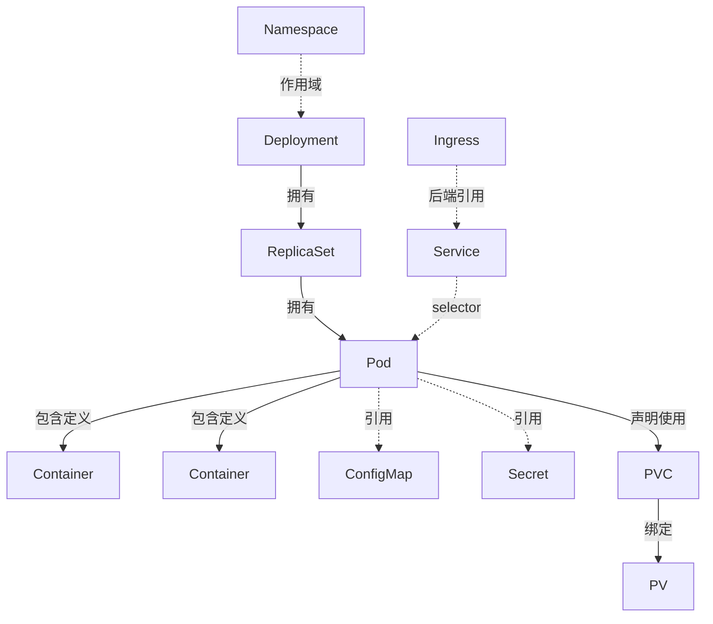
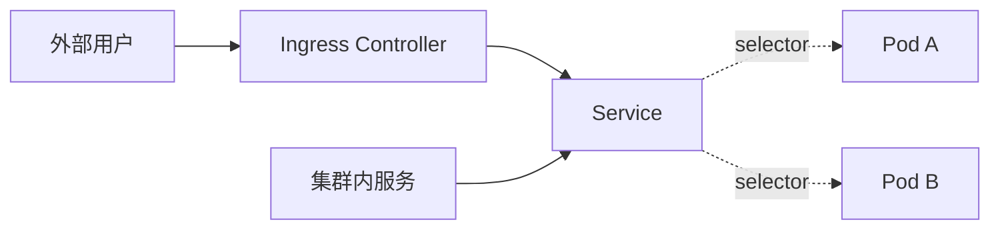

# 资源对象与协作关系

Kubernetes 通过 API 资源对象描述集群状态。对象并不只是配置文件中的字段集合：控制器会读取对象的期望状态，持续协调实际状态；不同对象分别承担运行、访问、配置、存储和治理等问题。

## 对象通用模型

多数面向期望状态的 Kubernetes 对象都可从以下几个部分理解：

| 部分 | 作用 |
| --- | --- |
| `apiVersion` | 指定对象所属 API 组和版本 |
| `kind` | 指定对象类型，例如 `Deployment`、`Service` |
| `metadata` | 提供名称、Namespace、Label、注解和 UID 等标识信息 |
| `spec` | 描述用户声明的期望状态 |
| `status` | 由 Kubernetes 组件写入观察到的当前状态 |

具体对象的字段并不完全相同，但“`spec` 表示期望、`status` 表示观察结果”的模型是理解控制器协调过程的基础。Container 不是独立 Kubernetes 资源，而是 Pod 的 `spec.containers` 中定义的运行单元；Downward API 也不是资源，而是把 Pod 或容器元数据投射到容器内的机制。

## 资源作用域

资源先要区分作用域。Namespace 只为命名空间级对象提供逻辑分组，不能约束集群级对象：

| 作用域 | 典型对象 | 说明 |
| --- | --- | --- |
| 命名空间级 | Pod、Deployment、Service、ConfigMap、Secret、PVC | 名称只需要在所属 Namespace 内唯一 |
| 集群级 | Node、Namespace、PersistentVolume、StorageClass、ClusterRole | 面向整个集群，不通过 `-n` 指定 Namespace |

## 按职责分类

| 分类 | 对象或机制 | 解决的问题 |
| --- | --- | --- |
| 运行单元 | Pod；PodSpec 中的 Container | 承载和运行应用进程 |
| 工作负载控制器 | Deployment、StatefulSet、DaemonSet、ReplicaSet | 管理 Pod 副本、更新方式或节点覆盖范围 |
| 任务控制器 | Job、CronJob | 执行一次性或周期性任务 |
| 服务发现与流量入口 | Service、EndpointSlice、Ingress；Gateway API 资源族 | 为动态 Pod 提供稳定访问名称、服务端点或入口路由 |
| 自动伸缩 | HorizontalPodAutoscaler（HPA） | 根据指标调整支持 `scale` 子资源的工作负载副本数 |
| 配置投射 | ConfigMap、Secret；Downward API | 将配置、敏感数据或运行时元数据提供给 Pod |
| 存储 | PV、PVC、StorageClass；CSI 驱动 | 管理持久化数据、卷声明和动态供给 |
| 隔离与授权 | Namespace、ResourceQuota、LimitRange、NetworkPolicy；Role、RoleBinding、ClusterRole、ClusterRoleBinding | 划分资源范围、使用上限、网络边界和访问权限 |

Gateway API 是一组可扩展 API 资源，而不是单一 Kind；RBAC 也是由多种授权对象组成的 API。将这些边界区分开，才能在后续章节中正确判断对象是由谁创建、谁维护以及谁引用。

## 标签与选择器

Label 是附在对象上的键值标记，Selector 用于按 Label 关联对象。Deployment 的 selector 用来让 ReplicaSet 管理自身创建的 Pod；Service 的 selector 用来选择后端 Pod 并由控制面维护 EndpointSlice。Service 与 Deployment 没有直接的所有者关系，它们通过 Pod Label 间接协作。

## 资源关系

实线表示控制器所有权、PodSpec 中的包含关系或存储绑定；虚线表示对象引用、作用域或 Label 选择关系。Pod 是 Kubernetes 中最小的可部署计算单元，也是容器运行的原子边界。生产环境通常由 Deployment、StatefulSet、DaemonSet 或 Job 等控制器创建和维护 Pod，而不是直接维护裸 Pod。

## 工作负载选择

| 对象 | 适合的运行形态 |
| --- | --- |
| Deployment | 无状态服务，或不需要稳定实例标识的长运行工作负载 |
| StatefulSet | 需要稳定网络标识、稳定存储或有序创建和删除的工作负载 |
| DaemonSet | 需要按节点覆盖部署的组件，例如日志采集、监控 Agent、网络组件 |
| Job | 一次性任务，例如数据迁移或初始化 |
| CronJob | 定时任务，例如备份、清理或报表 |

选择工作负载取决于运行语义，而不是应用使用的编程语言。Deployment 关注副本和滚动更新；StatefulSet 关注稳定标识与存储；DaemonSet 关注节点覆盖；Job 与 CronJob 关注任务完成状态。

## 服务访问

带 selector 的常规 `ClusterIP` Service 为一组匹配标签的 Pod 提供稳定虚拟 IP 和 DNS 名称。EndpointSlice Controller 会根据匹配结果维护后端端点，kube-proxy 或兼容的替代实现据此转发流量。

Headless Service、ExternalName Service 和没有 selector 的 Service 具有不同的解析或端点管理方式，不能套用上述 ClusterIP 与自动选择后端的结论。第 10 章会继续记录这些访问模型。

## 配置与敏感数据

ConfigMap 用于普通配置，Secret 用于敏感数据，例如密码、Token 和证书。它们可以通过环境变量或文件挂载注入 Pod，从而让镜像保持与环境配置分离。

Secret 的数据字段通常只是 Base64 编码，并不等于自动加密。敏感数据还需要配合最小 RBAC 权限、传输保护以及按需配置静态加密等措施；具体边界在第 11 章展开。

## 资源隔离

Namespace 是最常用的逻辑分组手段，但不是安全边界。完整治理需要配合 RBAC、ResourceQuota、LimitRange 和 NetworkPolicy，分别控制访问权限、命名空间资源总量、单个 Pod 或容器的资源范围和网络访问边界。NetworkPolicy 是否实际生效还取决于所选 CNI 是否支持并启用该能力。

## 为什么需要这些抽象

每个对象都对应一类独立问题：工作负载控制器维护 Pod，Service 和 EndpointSlice 维护访问目标，配置与存储对象提供运行时依赖，治理对象约束资源和访问范围。将它们拆分后，应用更新、服务发现、配置变更和权限调整可以各自演进，而不会互相承担不属于自己的职责。

## 参考

- [Kubernetes 中的对象](https://kubernetes.io/docs/concepts/overview/working-with-objects/)
- [工作负载](https://kubernetes.io/docs/concepts/workloads/)
