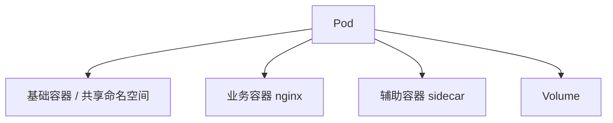
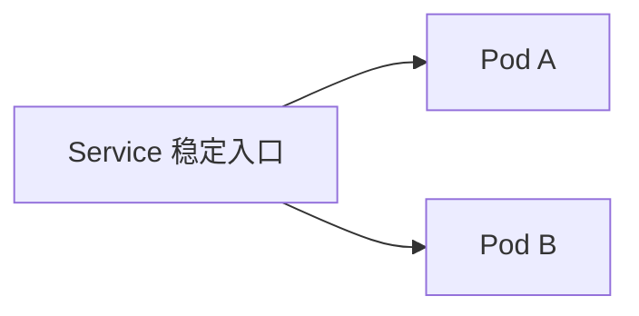

# Pod 概念及 Pod 架构

Pod 是 Kubernetes 中最小的可调度、可部署单元。Kubernetes 不直接调度单个容器，而是调度 Pod，容器则运行在 Pod 内部。

## Pod 与容器的关系

一个 Pod 可以包含一个或多个容器：



最常见的是单容器 Pod，例如一个 Nginx 应用。多容器 Pod 通常用于主容器和辅助容器紧密协作的场景。

## Pod 共享的资源

同一个 Pod 内的容器通常共享以下资源：

| 资源 | 说明 |
| --- | --- |
| 网络命名空间 | 共享 Pod IP 和端口空间 |
| 存储卷 | 通过 Volume 在容器之间共享文件 |
| 生命周期 | Pod 作为整体被调度、创建和删除 |
| 本地通信 | 容器之间可以通过 `localhost` 通信 |

由于共享网络命名空间，同一个 Pod 内的两个容器不能监听相同的端口。

## Pod IP

每个 Pod 会被分配一个独立 IP。集群内其他 Pod 可以通过这个 IP 直接访问它，但 Pod IP 并不稳定。

Pod 重建后，IP 可能发生变化。因此生产中不应依赖 Pod IP 作为稳定的访问入口，而应使用 Service。



## Pod 与 Node

Pod 被调度到某个 Node 后，由该节点上的 kubelet 负责创建和管理：


当 Node 异常时，控制器会在其他节点上重建被管理的 Pod。裸 Pod 没有上层控制器管理，不具备这种副本自愈能力。

## Pod 的基本组成

一个 Pod 的 YAML 通常包括以下部分：

```yaml
apiVersion: v1
kind: Pod
metadata:
  name: nginx
  labels:
    app: nginx
spec:
  containers:
    - name: nginx
      image: nginx:1.25
      ports:
        - containerPort: 80
```

字段含义：

| 字段 | 说明 |
| --- | --- |
| `apiVersion` | API 版本，Pod 通常为 `v1` |
| `kind` | 资源类型，这里是 `Pod` |
| `metadata` | 资源元数据，如名称、标签、Namespace |
| `spec` | 期望状态，描述容器、镜像、端口、卷等配置 |
| `status` | 当前状态，由 Kubernetes 维护，通常不手写 |

## 裸 Pod 与控制器

可以直接创建 Pod，但生产中很少直接使用裸 Pod。更常见的做法是使用 Deployment、StatefulSet、DaemonSet 等控制器创建和管理 Pod。

| 创建方式 | 特点 |
| --- | --- |
| 裸 Pod | 简单直接，但缺少副本管理和更新能力 |
| Deployment | 适合无状态应用，支持副本、滚动更新和回滚 |
| StatefulSet | 适合有状态应用，提供稳定身份和存储 |
| DaemonSet | 适合每个节点运行一个 Pod 的场景 |

本章直接使用 Pod，是为了理解最小运行单元；后续章节则会重点使用 Deployment 等控制器来管理 Pod。
