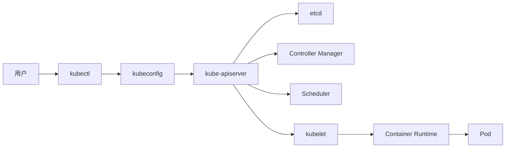
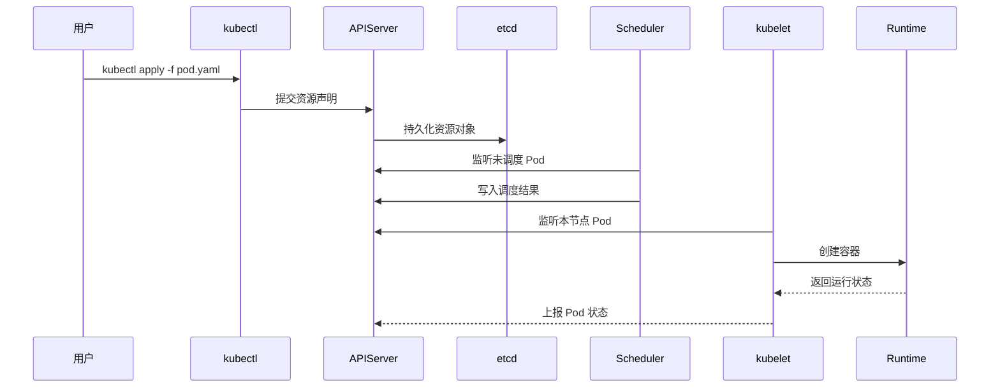

# 资源操作记录

前面的章节已经记录 Kubernetes 的定位：它不只是运行容器的工具，而是面向容器化应用的集群编排平台。本章进入实际操作阶段，通过 kubectl 与集群交互，观察资源如何被创建、存储、调度和运行。

## 操作闭环

本章记录以下基础操作闭环：

- 使用 kubectl 连接集群
- 查看集群中的资源对象
- 创建和删除基础资源
- 通过 YAML 描述期望状态
- 使用 Namespace 划分逻辑空间
- 使用 Pod 运行第一个容器化应用
- 根据状态、事件和日志定位问题

这些内容是后续记录 Deployment、Service、ConfigMap、Secret 等资源时的基础参照。

## Kubernetes 交互入口

kubectl 是 Kubernetes 的命令行管理工具。只要本地准备好 kubectl 二进制文件和有效的 kubeconfig，就可以从任意机器向集群的 APIServer 发起请求。

kubectl 本身不直接操作容器，也不直接连接工作节点。它把用户的请求提交给 APIServer，再由 Kubernetes 控制面和工作节点组件完成后续动作。

## 从命令到资源的链路

以创建 Pod 为例，常见链路如下：

这个过程体现了 Kubernetes 的声明式模型：用户提交期望状态，控制面保存并协调，节点组件负责执行和反馈。

## 本章实践资源

本章主要围绕三个入口资源展开：

| 资源或工具     | 记录重点                     |
|-----------|--------------------------|
| kubectl   | 集群连接、资源查看、创建、修改、删除和排障    |
| Namespace | 逻辑隔离、默认空间、资源归属和命名空间切换    |
| Pod       | 最小可部署计算单元、容器运行、状态观察和问题定位 |

其中 kubectl 是所有后续章节都会反复使用的工具，Namespace 是资源隔离和权限治理的基础，Pod 是理解 Kubernetes 应用运行机制的起点。

## 操作原则

kubectl 命令很多，日常操作按以下思路推进：

- 查看资源时使用 `kubectl get` 和 `kubectl describe`
- 创建资源时使用 `kubectl apply -f`
- 排查问题时按 `状态 -> 事件 -> 日志 -> 配置` 的顺序推进
- 编写 YAML 时使用 `kubectl explain` 查询字段含义
- 不确定资源简称时使用 `kubectl api-resources` 查询

后续记录各类资源时，继续沿用这套操作方法。
