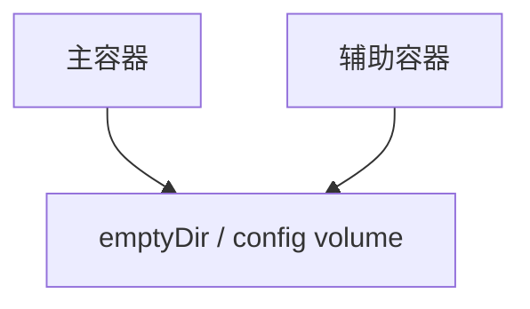

# Pod 设计思想及解决的问题

Kubernetes 选择 Pod 作为调度基本对象，而不是直接调度容器，是因为真实应用往往并非单个进程孤立运行。Pod 为一组需要紧密协作的容器提供同址、同调度、共享网络和共享存储的运行边界。

## 统一调度边界

如果两个容器必须部署在同一台机器上，并且生命周期强相关，把它们放在同一个 Pod 中就能保证一起调度。

例如：

- Web 容器与日志采集 Sidecar
- 业务容器与代理容器
- 应用容器与配置热更新容器

Scheduler 调度的对象是 Pod。只要容器在同一个 Pod 中，就一定会被调度到同一个 Node 上。

## 共享网络

同一个 Pod 内的容器共享网络命名空间，因此它们可以通过 `localhost` 互相访问。

这让辅助容器可以像本地进程一样增强主容器的能力，例如代理流量、采集指标、转发日志等。

## 共享存储

同一个 Pod 内的容器可以挂载同一个 Volume：

常见场景：

- 主容器写日志，Sidecar 读取并转发日志
- 初始化容器生成配置，业务容器读取配置
- 多个容器共享临时文件

## 生命周期协同

Pod 是一个整体的生命周期单位：创建时，其中的容器在同一个调度结果下运行；删除时，其中的容器也会一起终止。

这适合“必须一起运行”的容器组合，但不适合把完全独立的服务塞进同一个 Pod。独立服务应该拆成不同 Pod，再通过 Service 通信。

## Sidecar 模式

Sidecar 是 Pod 设计中最典型的模式。它把通用能力从业务容器中拆出来，作为辅助容器和业务容器一起运行。

常见 Sidecar 能力包括：

- 日志采集
- 代理转发
- 配置同步
- 证书刷新
- 指标采集

这种方式可以把通用的运维逻辑从业务镜像中剥离，让业务容器更专注于应用本身。

## 不适合放入同一个 Pod 的情况

以下场景不建议放入同一个 Pod：

- 两个服务需要独立扩缩容
- 两个服务生命周期不同
- 两个服务属于不同团队维护
- 两个服务资源需求差异很大
- 两个服务需要独立发布和回滚

Pod 是一组紧耦合的容器，而不是小型虚拟机。不要把多个无关的服务硬塞进同一个 Pod。

## Pod 解决的核心问题

Pod 的设计解决了三类问题：

| 问题      | Pod 的处理方式                |
|---------|--------------------------|
| 多容器协同部署 | 作为整体调度到同一个节点             |
| 本地进程式通信 | 共享网络命名空间，通过 localhost 访问 |
| 文件与配置共享 | 挂载同一个 Volume             |

明确 Pod 的边界后，再看 Deployment、StatefulSet、DaemonSet，就能看清它们都是在不同场景下管理 Pod。
