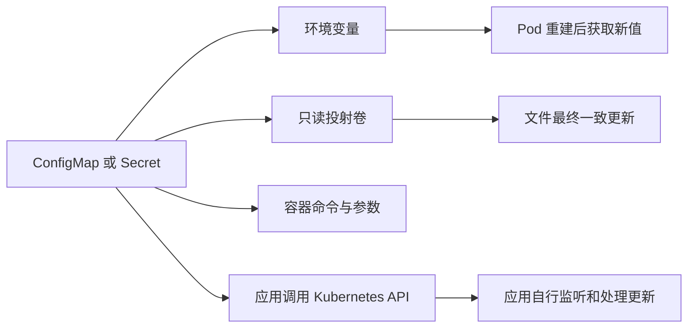

# 配置管理

上一章记录 Service、Ingress 与 Gateway API 如何把工作负载接入集群网络；应用能够被访问后，还需要把运行参数、配置文件和凭据从容器镜像中分离出来。

本章记录 ConfigMap 与 Secret 的资源边界、创建方式、Pod 注入路径、更新传播和安全约束，并为后续存储、任务与应用部署中的配置复用提供基础。

## 资源边界

ConfigMap 与 Secret 都是命名空间级 API 对象，Pod 通常只能直接引用同一命名空间中的对象。两者都能通过环境变量或只读卷向容器提供键值数据，但用途和安全要求不同。

| 对象        | 适合保存            | 不负责的范围               |
|-----------|-----------------|----------------------|
| ConfigMap | 非敏感参数、配置文件、命令参数 | 大文件、敏感凭据、应用主动重载      |
| Secret    | 密码、令牌、证书、镜像仓库凭据 | 自动启用静态加密、密钥轮换、外部密钥托管 |

单个 ConfigMap 或 Secret 的大小上限为 1 MiB。更大的内容应放入持久卷、对象存储、数据库或专用配置服务，不能依靠拆分大量小对象规避 API Server 和 kubelet 的内存成本。

## 配置路径

环境变量在容器启动时确定，不会随源对象变化；普通卷投射会由 kubelet 最终一致地更新文件，但应用是否重新读取文件仍由应用自身决定。使用 `subPath` 挂载单个文件时不会收到自动更新。

## 参考

- [ConfigMaps](https://kubernetes.io/docs/concepts/configuration/configmap/)
- [Secrets](https://kubernetes.io/docs/concepts/configuration/secret/)
- [Configure a Pod to use a ConfigMap](https://kubernetes.io/docs/tasks/configure-pod-container/configure-pod-configmap/)
- [Projected Volumes](https://kubernetes.io/docs/concepts/storage/projected-volumes/)
- [Good practices for Kubernetes Secrets](https://kubernetes.io/docs/concepts/security/secrets-good-practices/)
- [Encrypting Confidential Data at Rest](https://kubernetes.io/docs/tasks/administer-cluster/encrypt-data/)
- [ConfigMap API Reference](https://kubernetes.io/docs/reference/kubernetes-api/config-and-storage-resources/config-map-v1/)
- [Secret API Reference](https://kubernetes.io/docs/reference/kubernetes-api/config-and-storage-resources/secret-v1/)
