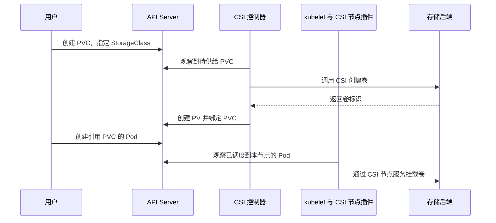

# StorageClass 与动态供给

静态供给要求管理员先创建后端存储和 PV。动态供给由 PVC 触发，StorageClass 指定供给器和参数，CSI 驱动负责创建后端卷，控制平面再生成并绑定 PV。

## CSI 边界

Container Storage Interface（CSI）是容器编排系统与存储驱动之间的标准接口。Kubernetes 负责调度、对象生命周期和调用驱动；CSI 驱动负责创建、删除、挂载、卸载以及可选的扩容、快照等后端操作。

集群可以安装多个 CSI 驱动，并用不同 StorageClass 暴露容量、性能、回收策略或故障域。`CSIDriver` 对象描述驱动能力，`StorageClass.provisioner` 必须与驱动注册名称一致。

```bash
kubectl get csidriver
kubectl get sc
```

## 动态供给流程



动态供给减少手工 PV 管理，但不会自动选择合适的高可用、备份或性能策略，这些仍要由 StorageClass 和后端设计明确表达。

## 关键字段

| 字段                     | 作用                                                     |
|------------------------|--------------------------------------------------------|
| `provisioner`          | CSI 驱动或供给器名称                                           |
| `parameters`           | 传递给供给器的后端特定参数，不能跨驱动照搬                                  |
| `reclaimPolicy`        | 动态 PV 的 `Delete` 或 `Retain` 策略，省略时默认 `Delete`          |
| `volumeBindingMode`    | `Immediate` 或 `WaitForFirstConsumer`，省略时默认 `Immediate` |
| `allowVolumeExpansion` | 是否允许通过增大 PVC 请求触发扩容                                    |
| `mountOptions`         | 动态 PV 的挂载参数；API 不验证其正确性                                |
| `allowedTopologies`    | 必要时限制可供给卷的区域或节点拓扑                                      |

StorageClass 创建后通常不应原地改变供给语义；它的修改也不会追溯改变已有 PV。需要调整参数时，更稳妥的做法是创建新名称的 StorageClass，让新 PVC 显式选择它。

## 可变卷属性

Kubernetes v1.36 中，`storage.k8s.io/v1` 的 VolumeAttributesClass 已稳定且对应特性门控锁定启用。它由管理员定义 `driverName` 和驱动特定 `parameters`，用于表达可变的卷服务等级，例如支持该机制的存储后端所提供的 IOPS 或吞吐量档位。

StorageClass 决定卷的初始供给方式，VolumeAttributesClass 则由 PVC 的 `spec.volumeAttributesClassName` 引用；把该字段改为另一个类时，外部 Resizer 会调用 CSI `ModifyVolume`。只有 CSI 驱动和后端实现该能力时才会生效，类中的参数本身不可变。该机制不改变 PVC 容量，也不能替代扩容、快照或数据迁移；本章的 NFS 示例不依赖它。

## 绑定时机

`Immediate` 在 PVC 创建后立即绑定或供给。NFS 等可从所有节点访问的存储通常适合该模式。

`WaitForFirstConsumer` 会等到出现使用 PVC 的 Pod，再结合 Pod 的资源请求、节点选择、亲和性和拓扑分布选择或创建卷。区域云盘、本地卷等受拓扑限制的存储通常应使用该模式，避免先创建在错误故障域导致 Pod 无法调度。

> [!WARNING]
> 使用 `WaitForFirstConsumer` 时不要在 Pod 中设置 `spec.nodeName` 绕过调度器，否则 PVC 可能一直 `Pending`。需要固定节点时使用 `nodeSelector` 或节点亲和性，让调度器仍能参与决策。

## 默认 StorageClass

带有下面注解的 StorageClass 会成为默认类：

```yaml{4,5}
metadata:
  name: standard
  annotations:
    storageclass.kubernetes.io/is-default-class: "true"
```

这是用于说明默认类注解的片段，不是完整 StorageClass。集群应尽量只保留一个默认类；如果同时存在多个默认类，未指定 `storageClassName` 的新 PVC 会使用最近创建的默认类。

PVC 的选择语义需要区分：

- 省略 `storageClassName`：使用默认 StorageClass；没有默认类时先保持未设置，之后可能被追溯补上新默认类。
- `storageClassName: ""`：明确请求无存储类的 PV，不会使用默认类。
- `storageClassName: nfs-csi`：只选择指定类。

## 动态 PVC 示例

下面的清单依赖下一页创建的 `nfs-csi` StorageClass：

```yaml [dynamic-pvc-pod.yaml]
apiVersion: v1
kind: PersistentVolumeClaim
metadata:
  name: shared-data
spec:
  accessModes:
    - ReadWriteMany
  storageClassName: nfs-csi
  resources:
    requests:
      storage: 2Gi
---
apiVersion: v1
kind: Pod
metadata:
  name: dynamic-volume-writer
spec:
  restartPolicy: Never
  containers:
    - name: writer
      image: busybox:1.38
      command: ["sh", "-c", "date -Iseconds >> /data/history.log && sleep 3600"]
      volumeMounts:
        - name: data
          mountPath: /data
  volumes:
    - name: data
      persistentVolumeClaim:
        claimName: shared-data
```

完成 NFS CSI 和 StorageClass 部署后创建：

```bash
kubectl create -f dynamic-pvc-pod.yaml
kubectl get pvc shared-data
kubectl get pv
kubectl describe po dynamic-volume-writer
```

StatefulSet 可以在 `volumeClaimTemplates` 中复用同一 StorageClass，为每个 Pod 生成独立 PVC。资源结构和保留策略见 [StatefulSet 独立存储](/09-工作负载/2-StatefulSet#独立存储)，这里不重复清单。

## 参考

- [StorageClass](https://kubernetes.io/docs/concepts/storage/storage-classes/)
- [动态卷供给](https://kubernetes.io/docs/concepts/storage/dynamic-provisioning/)
