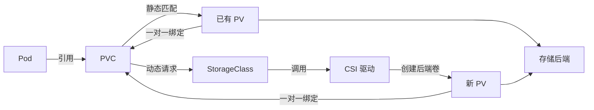

# 存储管理

上一章把应用配置与敏感凭据从镜像中分离出来；当数据需要跨容器重启、Pod 重建或节点迁移保留时，还需要独立于容器可写层的存储抽象。

本章记录 Volume、PersistentVolume、PersistentVolumeClaim、StorageClass、VolumeAttributesClass 与 CSI 的协作关系，并以 NFS CSI 展示静态绑定、动态供给、扩容、快照边界和常见排障路径，为有状态工作负载提供存储基础。

## 对象边界

| 对象                         | 作用域        | 主要职责                            |
|----------------------------|------------|---------------------------------|
| Volume                     | Pod 规格的一部分 | 声明数据源，并由各容器通过 `volumeMounts` 挂载 |
| PersistentVolume（PV）       | 集群级        | 表示一份已经存在或动态创建的持久存储              |
| PersistentVolumeClaim（PVC） | 命名空间级      | 描述工作负载对容量、访问模式、存储类和卷模式的请求       |
| StorageClass               | 集群级        | 定义动态供给器、回收策略、绑定时机、扩容能力和后端参数     |
| VolumeAttributesClass     | 集群级        | 为支持 `ModifyVolume` 的 CSI 卷定义可变服务等级      |
| CSIDriver                  | 集群级        | 描述集群中注册的 CSI 驱动能力               |

PV 与 PVC 把存储实现和工作负载解耦，但不等同于备份、复制或高可用。数据可靠性、故障域、性能、配额和快照能力最终仍取决于存储后端与 CSI 驱动。

## 协作关系

## 参考

- [Volumes](https://kubernetes.io/docs/concepts/storage/volumes/)
- [Ephemeral Volumes](https://kubernetes.io/docs/concepts/storage/ephemeral-volumes/)
- [Local Ephemeral Storage](https://kubernetes.io/docs/concepts/storage/ephemeral-storage/)
- [Persistent Volumes](https://kubernetes.io/docs/concepts/storage/persistent-volumes/)
- [Storage Classes](https://kubernetes.io/docs/concepts/storage/storage-classes/)
- [Volume Attributes Classes](https://kubernetes.io/docs/concepts/storage/volume-attributes-classes/)
- [Dynamic Volume Provisioning](https://kubernetes.io/docs/concepts/storage/dynamic-provisioning/)
- [Volume Snapshots](https://kubernetes.io/docs/concepts/storage/volume-snapshots/)
- [CSI Volume Cloning](https://kubernetes.io/docs/concepts/storage/volume-pvc-datasource/)
- [NFS CSI Driver](https://github.com/kubernetes-csi/csi-driver-nfs)
- [NFS CSI Driver Snapshot Example](https://github.com/kubernetes-csi/csi-driver-nfs/tree/v4.13.4/deploy/example/snapshot)
