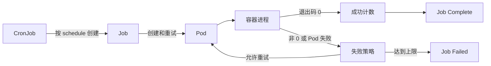

# 任务管理

上一章记录持久卷如何为有状态数据和共享文件提供独立生命周期；批处理、备份和数据转换等有限时长工作还需要能够跟踪完成、失败和重试的控制器。

本章记录 Job 与 CronJob 的资源边界、并行完成模型、失败策略、自动清理和周期调度语义，并结合持久卷与 Secret 整理数据库备份任务，为后续自动化运维和弹性工作负载提供基础。

## 控制器边界

| 对象      | 直接管理       | 完成语义                             |
|---------|------------|----------------------------------|
| Job     | 一个或多个 Pod  | 达到指定成功次数或成功策略后完成，超过失败或时间限制后失败    |
| CronJob | 按计划创建的 Job | 负责调度和历史保留，不直接执行容器，也不保证恰好创建一次 Job |

Job 和 CronJob 都是命名空间级对象。任务使用的 ConfigMap、Secret 和 PVC 通常必须与任务位于同一命名空间。

任务控制器只能根据 Pod 状态、退出码和声明策略判断结果，不能自动识别业务是否重复执行。外部写入、消息消费和备份命名应具备幂等性，尤其是 CronJob 可能重复创建或漏建某次 Job。

## 参考

- [Jobs](https://kubernetes.io/docs/concepts/workloads/controllers/job/)
- [CronJob](https://kubernetes.io/docs/concepts/workloads/controllers/cron-jobs/)
- [Automatic Cleanup for Finished Jobs](https://kubernetes.io/docs/concepts/workloads/controllers/ttlafterfinished/)
- [Handling retriable and non-retriable pod failures with Pod failure policy](https://kubernetes.io/docs/tasks/job/pod-failure-policy/)
- [Job API Reference](https://kubernetes.io/docs/reference/kubernetes-api/workload-resources/job-v1/)
- [CronJob API Reference](https://kubernetes.io/docs/reference/kubernetes-api/workload-resources/cron-job-v1/)
